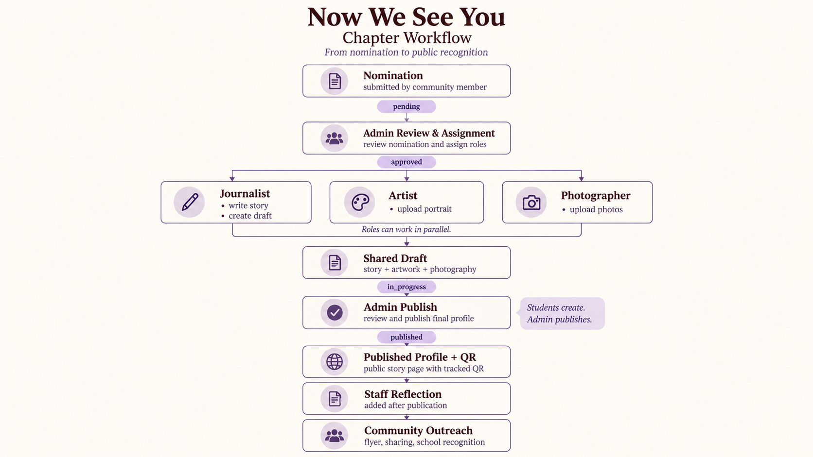
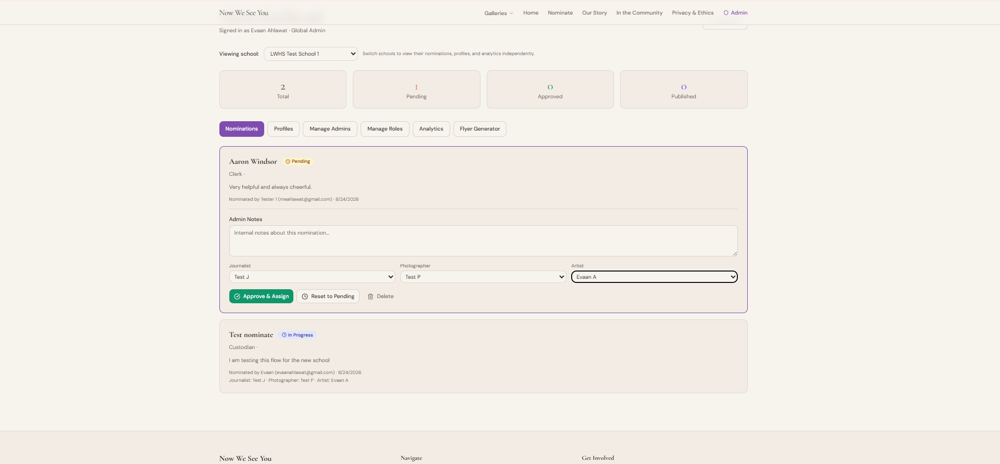
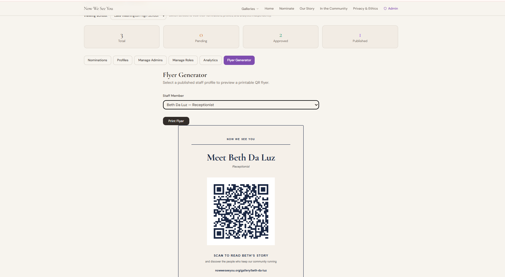
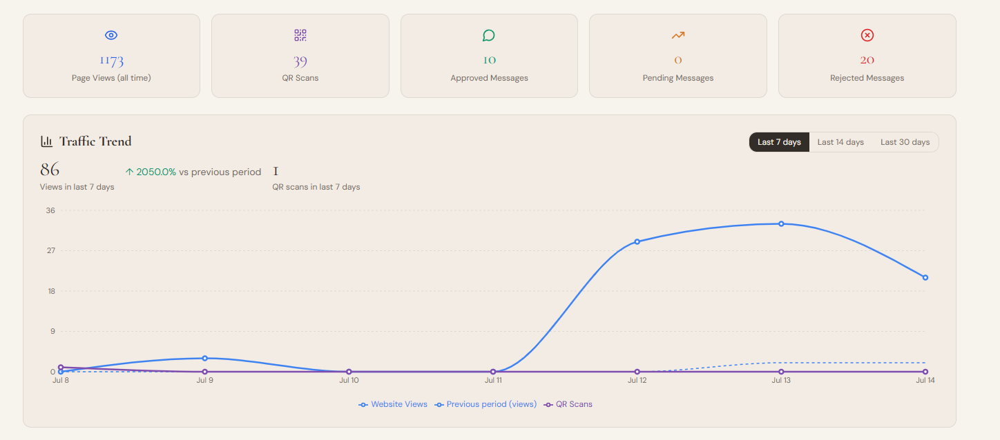

# Now We See You

**[nowweseeyou.org](https://nowweseeyou.org)**

Now We See You is a consent-based recognition platform I built for the people in a school community who are seen every day but are often not known by name.

The project started at Lake Washington High School in Kirkland, Washington. I interview staff members, create charcoal portraits, and build permanent profiles that combine their stories, photographs, appreciation messages, and QR-based recognition in the school.

What began as a project I mostly ran myself has grown into a platform designed so a student team, and eventually another school chapter, can run the same process without rebuilding the application.

**Created by:** Evaan Ahlawat, Lake Washington High School  
**Live site:** [nowweseeyou.org](https://nowweseeyou.org)  
**Original Google Sites prototype:** [Now We See Me](https://sites.google.com/view/now-we-see-me)  
**Technical design:** [`public/docs/technical-design-document.md`](./public/docs/technical-design-document.md)  
**Testing:** [`test.md`](./test.md)  
**AI disclosure:** [`AI_DISCLOSURE.md`](./AI_DISCLOSURE.md)

---

## Why I built it

The first person I drew was Brad Fisher, a custodian at my school.

I had seen Brad constantly, but I did not really know him.

That made me think about how easily someone can become familiar without actually being seen.

Custodians, receptionists, bookkeepers, office professionals, and other classified staff keep a school working every day. Students may pass them hundreds of times without knowing their names or what they contribute.

A thank-you card eventually disappears. A recognition event ends.

I wanted to build something that could last.

Now We See You connects physical recognition in the school to a permanent digital story. A student can see a portrait or QR flyer, scan it, learn the person's name and story, and leave a message of appreciation.

The goal is not just to archive people after they leave. It is to help a community notice them while they are still there.

---
## Table of contents

- [Why I built it](#why-i-built-it)
- [What the platform does](#what-the-platform-does)
- [Design and implementation evidence](#design-and-implementation-evidence)
- [How a recognition moves through the platform](#how-a-recognition-moves-through-the-platform)
- [From one person to a student team](#from-one-person-to-a-student-team)
- [Real-world use](#real-world-use)
- [Building for another school](#building-for-another-school)
- [Engineering challenges](#engineering-challenges)
- [Development history (monthly)](#development-history)
- [Testing](#testing)
- [Privacy and consent](#privacy-and-consent)
- [AI disclosure](#ai-disclosure)

## What the platform does

### For the public

- **Staff profiles** with charcoal portraits, interviews, stories, photography, and contributor attribution
- **Consent-based publishing** so a staff member is not publicly profiled without approval
- **Appreciation wall** where students and staff can leave messages that are moderated before publication
- **QR codes** connecting physical portraits and flyers to digital profiles
- **Tracked QR redirects** so printed QR codes can keep working even if their destination changes later
- **Profile sharing** through the native mobile share sheet with a desktop clipboard fallback
- **Staff Reflections** that can be added after publication, once the recognized person has experienced the portrait and recognition
- **Public nominations** for future staff members

### For a student chapter

- **Journalist, Artist, Photographer, and Community Outreach roles**
- **Role-based Club Dashboard**
- **Nomination-first creative workflow**
- **Shared draft profiles**
- **Administrator review and publishing**
- **Tracked QR generation**
- **Print-ready Flyer Generator**

### For expansion

- **Multiple schools**
- **Global and school-level administrators**
- **School-scoped profiles, nominations, roles, analytics, and settings**
- **Public chapter galleries**
- **Chapter onboarding without manually editing the database**

---
## Design and implementation evidence

I kept the design documents as the system evolved so the repository shows not only the final product, but also what I originally planned and what I changed after implementation.

| Area | Documentation | Evidence |
|---|---|---|
| Current architecture | [`technical-design-document.md`](./public/docs/technical-design-document.md) | Current architecture map |
| Club roles and permissions | [`club-roles-spec.md`](./docs/club-roles-spec.md) | [`Final workflow`](./docs/assets/roles-and-nomination-workflow-sep2026.png), [`Journalist`](./docs/assets/club-dashboard-role-workflow-sep2026.png), [`Photographer`](./docs/assets/club-dashboard-photographer-sep2026.png), [`Admin publish`](./docs/assets/admin-publish-control-sep2026.png) |
| Original role design | [`club-roles-spec.md`](./docs/club-roles-spec.md) | [`July workflow`](./docs/assets/roles-and-nomination-workflow-jul2026.png) |
| Multi-school architecture | [`multi-school-admin.md`](./docs/multi-school-admin.md) | [`Chapter test`](./docs/assets/chapter-directory-sep2026.png), [`Approve & Assign`](./docs/assets/admin-approve-assign-sep2026.png) |
| New chapter onboarding | [`start-a-chapter-guide.md`](./docs/start-a-chapter-guide.md) | End-to-end chapter test in [`test.md`](./test.md) |
| Flyer Generator | [`flyer-generator.md`](./docs/flyer-generator.md) | [`Final Flyer Generator`](./docs/assets/flyer-generator-sep2026.png) |
| Profile sharing | [`share-button.md`](./docs/share-button.md) | [`Mobile`](./docs/assets/share-button-jul2026.png), [`Desktop`](./docs/assets/share-button-desktop-jul2026.png) |
| QR architecture | [`retrospective-qr-redirect.md`](./docs/retrospective-qr-redirect.md) | QR and scan verification in [`test.md`](./test.md) |
| Founder to club transition | [`retrospective-one-person-to-club.md`](./docs/retrospective-one-person-to-club.md) | Club Dashboard evidence |
| Testing | [`test.md`](./test.md) | Historical and September end-to-end results |
| AI use | [`AI_DISCLOSURE.md`](./AI_DISCLOSURE.md) | Technical ownership disclosure |

The `docs/assets/` directory also contains earlier screenshots from the project's development history.

I have kept some of those because they show how the application changed rather than presenting the final system as if it appeared all at once.

---

## How a recognition moves through the platform

The workflow changed significantly as I moved the project from something I operated myself into something a student team could run.



The main workflow is:

```text
Nomination
    ↓
Admin review and role assignment
    ↓
Journalist + Artist + Photographer
    ↓
Shared draft
    ↓
Admin review and publish
    ↓
Published profile + QR
    ↓
Staff Reflection
    ↓
Community Outreach
```

The creative roles can work in parallel.

The Journalist writes the story and creates the draft profile. The Artist can work on the portrait and the Photographer can upload photographs without waiting for the entire story to be finished.

The most important permission boundary is:

**Students create. Admin publishes.**

That rule is enforced in the database as well as the interface.

The full design history, including the original July workflow and what changed during implementation, is documented in [`docs/club-roles-spec.md`](./docs/club-roles-spec.md).

Original workflow design: [`roles-and-nomination-workflow-jul2026.png`](./docs/assets/roles-and-nomination-workflow-jul2026.png)

---

## From one person to a student team

Originally, most of the project depended on me.

I interviewed the staff member, created the portrait, wrote the profile, uploaded the content, generated the QR code, and maintained the website.

That worked for the first profiles, but it would not scale.

I redesigned the platform around separate student responsibilities:

| Role | Responsibility |
|---|---|
| Journalist | Interview, write the story, and create/edit the draft profile |
| Artist | Create and upload portrait artwork |
| Photographer | Upload supporting photography |
| Community Outreach | Generate flyers and share published recognition |
| Administrator | Review nominations, assign roles, review work, and publish |

Students sign in through the same authentication system but are routed according to their permissions.

### Journalist workflow


An assigned Journalist can see the nomination, the creative work already attached to it, and the current workflow state.

The Journalist can create and edit the write-up but cannot publish it.

A Photographer working on the same nomination gets a different set of controls.

Supporting evidence:

- [`Photographer Club Dashboard`](./docs/assets/club-dashboard-photographer-sep2026.png)
- [`Administrator publishing control`](./docs/assets/admin-publish-control-sep2026.png)

The full permission model and implementation decisions are in [`docs/club-roles-spec.md`](./docs/club-roles-spec.md).

I also documented why I changed the project from a founder-operated workflow to a chapter model in [`docs/retrospective-one-person-to-club.md`](./docs/retrospective-one-person-to-club.md).

---

## Nomination to assignment

Anyone can nominate someone through:

**[nowweseeyou.org/nominate](https://nowweseeyou.org/nominate)**

A nomination first enters the administrator dashboard as `pending`.

The administrator can review the nomination, add internal notes, and assign the creative team.



The active nomination states are:

```text
pending → approved → in_progress → published
```

After approval, the creative roles can begin their work.

The Journalist's first save creates the linked draft profile and moves the nomination into `in_progress`.

Publication remains an administrator checkpoint.

---

## Connecting the digital project to the physical school

I did not want Now We See You to exist only as a website.

The physical portrait, flyer, or display is what makes someone stop and notice the person.

Each published profile can therefore have a tracked QR code.

The administrator dashboard contains a Flyer Generator that creates a printable placard:



The QR does not have to point directly to a hard-coded profile URL.

It can route through a redirect system that lets the destination change later without reprinting the physical QR code.

The redirect also records scan activity.

That means I can measure whether someone actually moved from the physical recognition to the person's story.

Technical details:

- [`docs/flyer-generator.md`](./docs/flyer-generator.md)
- [`docs/retrospective-qr-redirect.md`](./docs/retrospective-qr-redirect.md)

---

## Current profiles

Six real Lake Washington High School staff profiles have been published:

- **Brad Fisher** - Head Custodian
- **Shirley P.** - Bookkeeper / Accounting Technician
- **Pauline Gillespie** - Office Professional
- **Jose Guerrero** - Night Lead Custodian
- **Michele Raymer** - Transition Center Teacher
- **Beth Da Luz** - Receptionist

Brad Fisher's portrait was also exhibited at the Kirkland Arts Center in 2026.

---

## Real-world use

Now We See You is not only a demo application.

### Recorded engagement as of July 2026

- **1,173 profile page views**
- **39 QR scans**
- **10 approved appreciation messages**
- **3 nominations received from LWSD staff email addresses**
- **16 scans** from Brad's QR at the Kirkland Arts Center exhibition
- **2,050% traffic increase** during the week of the exhibition



More detailed evidence:

[`Per-profile analytics`](./docs/assets/analytics-per-profile-breakdown-jul2026.png)

These figures come from actual platform activity rather than seeded demonstration data.

The original production screenshots from this stage of the project are preserved in [`docs/assets/`](./docs/assets/).

---

## Building for another school

One of the biggest questions I wanted to answer was:

**Could another school use Now We See You without me rebuilding the application?**

I added:

- a `schools` data model
- global and school-level administrators
- school-scoped nominations
- school-scoped profiles
- school-scoped club roles
- school-scoped analytics
- school settings
- chapter-specific public galleries
- administrator-based school onboarding

Before another real school chapter was available, I created a temporary test school and ran the full workflow through it.


The second chapter shown in this screenshot is **test data**, not a second live school.

I used it to verify:

1. creating a school
2. creating its first administrator
3. assigning student roles
4. submitting a nomination
5. reviewing and assigning the nomination
6. logging in through different role accounts
7. creating a draft profile
8. uploading artwork and photography
9. administrator review
10. publication
11. school-level data isolation

That test was important because it tested the chapter as a complete system rather than checking each screen separately.

The detailed architecture and test evidence are in:

[`docs/multi-school-admin.md`](./docs/multi-school-admin.md)

The onboarding process for a future chapter is documented separately in:

[`docs/start-a-chapter-guide.md`](./docs/start-a-chapter-guide.md)

---

## Engineering challenges

The most difficult parts of Now We See You were not individual pages. They were the systems connecting them.

### Role-based access

Giving every student administrator permissions would have been easy, but it would also have been unsafe.

The role system determines both what a person sees and what the database allows that person to change.

A Journalist can edit an assigned draft but cannot publish it.

An Artist or Photographer can work with the media allowed for their assignment.

Community Outreach can generate flyers without receiving the rest of the administrator dashboard.

### School isolation

A school administrator should never be able to see or change another school's information.

I did not want that boundary to depend only on a school dropdown in React.

The application therefore uses Supabase Row Level Security and database permission checks to enforce school boundaries.

### Nomination-first media

My first design treated the profile as the container for everything.

That created a problem: the Artist or Photographer would have to wait for the Journalist to create the profile.

In the final system, creative work can be attached to the nomination first.

That lets different students work in parallel and matches how the real club process works.

### Administrator-only publication

The original role design allowed the Journalist to publish.

I changed that while implementing and testing the Club Dashboard.

Writing and publishing turned out to be different kinds of permission.

A student should be able to do real creative work without administrator access, but publishing changes what the public sees about another person.

So the final rule became:

**Journalist can create and edit. Administrator publishes.**

I also enforced this in the database rather than only hiding the Publish button in the interface.

### Permanent physical QR codes

A printed QR code may stay on a wall much longer than the code around the website stays unchanged.

Separating the physical QR identifier from its final destination means I can update the destination without replacing the printed placard.

### Two generations of QR infrastructure

Some earlier QR codes already existed through the separate `heros-redirect` service before the main application gained its own redirect system.

Rather than breaking those codes, I kept them working and combined their analytics while avoiding overlapping counts.

### Moving from founder workflow to team workflow

The original application assumed that one person controlled most of the process.

Adding student roles affected authentication, nominations, draft creation, media uploads, QR generation, publication permissions, and the database schema.

This became one of the largest architectural changes in the project.

---

## Tech stack

- React
- TypeScript
- Vite
- Tailwind CSS
- Supabase PostgreSQL
- Supabase Authentication
- Supabase Storage
- Supabase Row Level Security
- Supabase Edge Functions
- PL/pgSQL
- Playwright

The main site is deployed at **nowweseeyou.org**.

I also used Lovable as an AI-assisted development tool, particularly during the earlier React/Supabase build.

My use of AI is documented rather than hidden:

[`AI_DISCLOSURE.md`](./AI_DISCLOSURE.md)

---

## Architecture

The main application handles:

- staff profiles
- nominations
- appreciation messages
- student role assignments
- school administrators
- school/chapter data
- profile and nomination media
- QR generation
- QR analytics
- profile page analytics
- public galleries
- publishing

A separate Next.js project, [`heros-redirect`](https://github.com/van-sudo-git/heros-redirect), continues to support QR codes created earlier in the project.

The administrator analytics dashboard combines information from both QR systems.

### Main database tables

| Table | Purpose |
|---|---|
| `schools` | School/chapter records |
| `school_admins` | School and global administrator access |
| `profiles` | Staff profile content and publication state |
| `club_roles` | Student role assignments |
| `nominations` | Nomination state and assigned creative roles |
| `profile_images` | Portrait and supporting media |
| `appreciations` | Moderated appreciation messages |
| `redirects` | QR identifier to destination mapping |
| `redirect_events_daily` | Daily QR scan totals |
| `page_views` | Profile page-view counts |

Row Level Security is enabled on application tables.

Administrative and role-based access is enforced through database policies and helper functions rather than depending only on frontend controls.

For a shorter current architecture map, see:

[`public/docs/technical-design-document.md`](./public/docs/technical-design-document.md)

---

## Key backend components

### Appreciation moderation

`supabase/functions/moderate-appreciation`

Appreciation messages are moderated before they can appear publicly.

This is especially important because the application is being used around real staff members in a school.

### QR redirects

`supabase/functions/qr-redirect`

The QR redirect function resolves a tracked identifier to the saved profile destination and records scan activity.

### Database migrations

`supabase/migrations/`

The migrations are the source of truth for the production schema, Row Level Security policies, role permissions, school isolation, workflow changes, and analytics functions.

---

## Public routes

The public chapter structure is:

```text
/galleries
/galleries/:schoolSlug
/gallery/:profileSlug
```

`/galleries` lists public chapters.

A school only appears there after it has at least one published profile.

Creating a school in the administrator dashboard does not automatically make it look like a live chapter.

Individual staff profiles remain on the original singular `/gallery/:profileSlug` route so existing physical QR codes do not break when the chapter navigation changes.

---

## Testing

I kept the earlier testing history instead of rewriting it after the application changed.

The original July testing covered:

- published profiles
- authentication
- QR redirects
- nominations
- appreciation moderation
- analytics
- sharing
- Flyer Generator
- multi-school administration
- role management

As the platform expanded, I added end-to-end chapter testing with temporary school and role accounts.

### End-to-end test chapter

The temporary test chapter included:

- new school creation
- school administrator creation
- Journalist role assignment
- Photographer role assignment
- Artist role assignment
- Community Outreach role assignment
- fake nomination submission
- administrator approval and assignment
- Journalist draft-profile creation
- photography upload
- artwork workflow
- content editing
- administrator review
- administrator publication

The Journalist test account:


The corresponding Photographer workflow is preserved here:

[`club-dashboard-photographer-sep2026.png`](./docs/assets/club-dashboard-photographer-sep2026.png)

The administrator publication boundary is preserved here:

[`admin-publish-control-sep2026.png`](./docs/assets/admin-publish-control-sep2026.png)

### September production regression

The final production regression covered:

- public chapter routes
- school isolation
- nomination to assignment
- Club Dashboard workflows
- overlapping student roles
- administrator-only publishing
- Staff Reflection
- contributor attribution
- tracked QR generation
- publish/unpublish synchronization
- profile-specific metadata
- sitemap generation
- mobile public workflows
- mobile Club Dashboard workflows
- administrator mobile behavior

All major workflows passed.

The administrator dashboard works on mobile, although some dense admin screens are compressed on narrow phones and are easier to use on a laptop or desktop.

Full test history:

[`test.md`](./test.md)

### Automated checks

```bash
npx playwright install chromium
npx tsx scripts/verify-live-browser.ts
npx tsx scripts/verify-live-readonly.ts
```

### Repository checks

```bash
npm test
npm run lint
npm run build
```

The build process regenerates the sitemap and LLM files before the Vite build.

---

## Profile sharing

Every published staff profile has a Share action.

On supported mobile devices, the site uses the native share sheet.

On desktop, it falls back to copying the profile URL.

The detailed implementation and manual testing are in:

[`docs/share-button.md`](./docs/share-button.md)

Historical evidence:

- [`share-button-jul2026.png`](./docs/assets/share-button-jul2026.png)
- [`share-button-desktop-jul2026.png`](./docs/assets/share-button-desktop-jul2026.png)

---

## Privacy and consent

The people being recognized should control how they appear.

Every real staff member published through Now We See You has given consent before publication.

The process includes:

- asking whether the nominee already knows about the nomination
- speaking with the person before beginning the profile
- explaining what the project is
- receiving permission for the portrait and story
- allowing the staff member to review their profile
- allowing the profile to be unpublished if requested
- moderating appreciation messages before they appear publicly

Staff Reflection happens later because I want the person to respond after they have actually experienced receiving the portrait and recognition.

The platform is supposed to give power to the people being profiled, not just the people building it.

---

## AI disclosure

I used AI development tools during this project, and I think it is important to explain that clearly.

The original Google Sites prototype came first.

The first React and Supabase application foundation was then developed with Lovable assistance from my requirements and design direction.

As the application became more complicated, I worked directly with the repository on later architecture decisions, database changes, role workflows, testing, debugging, and documentation.

The portraits, interviews, staff relationships, consent conversations, and decisions about what Now We See You should become are my own work.

Full disclosure:

[`AI_DISCLOSURE.md`](./AI_DISCLOSURE.md)

---

## Repository structure

```text
nowweseeyou/
├── docs/
│   ├── assets/
│   ├── club-roles-spec.md
│   ├── flyer-generator.md
│   ├── multi-school-admin.md
│   ├── retrospective-one-person-to-club.md
│   ├── retrospective-qr-redirect.md
│   ├── share-button.md
│   └── start-a-chapter-guide.md
├── public/
│   └── docs/
│       └── technical-design-document.md
├── scripts/
├── src/
│   ├── components/
│   ├── hooks/
│   ├── integrations/
│   ├── lib/
│   └── pages/
├── supabase/
│   ├── functions/
│   └── migrations/
├── AI_DISCLOSURE.md
├── test.md
└── .env.example
```

---

## Local development

```bash
npm install
npm run dev
```

Create a local `.env` using `.env.example`.

Production keys and service-role credentials should never be committed.

---

## Development history

### September 2026

- Completed end-to-end chapter testing using a temporary second school
- Tested Journalist, Photographer, Artist, and Community Outreach permissions
- Tested nomination, role assignment, draft creation, media contribution, administrator review, and publishing
- Added final Club Dashboard workflow evidence
- Added administrator-only publishing evidence
- Added final multi-school testing evidence
- Added the final chapter workflow diagram
- Added the final Flyer Generator screenshot and documentation
- Completed final production regression
- Fixed production-domain profile redirects after slug changes
- Regenerated the production sitemap and generated files
- Updated public appreciation dates to show month and year

### August 2026

- Built the Club Dashboard
- Added Journalist, Photographer, Artist, and Community Outreach roles
- Added role-aware login routing
- Added invitation claiming for role accounts
- Added nomination-first creative media
- Added Journalist draft-profile creation
- Added administrator-only publishing
- Added database-level role permissions
- Added Staff Reflection and contributor workflow

### July 2026

- Added multi-school administration
- Added global and school-level administrator behavior
- Added school-level data isolation
- Added Flyer Generator
- Added native profile sharing
- Added public school selection to nominations
- Added automated browser and database verification
- Documented analytics evidence
- Added four additional staff profiles

### June 2026

- Brad Fisher's portrait exhibited at the Kirkland Arts Center
- Exhibition QR recorded 16 scans
- Appreciation-message moderation running in production

### March-May 2026

- Built the first React/Supabase version
- Added staff profiles
- Added appreciation messages
- Added nominations
- Added QR redirects
- Added administrator dashboard
- Added analytics
- Published the first staff profiles

---

## What I want to test next

The next challenge is not another major feature.

It is seeing what happens when a real group of students uses the chapter workflow independently.

The software now supports the process end to end.

The next stage is learning whether a Journalist, Artist, Photographer, and Community Outreach student can coordinate through it without relying on me to explain every step.

That will show me where the chapter workflow is confusing and what needs to change before another real school uses it.

If that works, Now We See You can become more than a project at one school.

It can become a repeatable way for students to notice the people who have been around them all along.