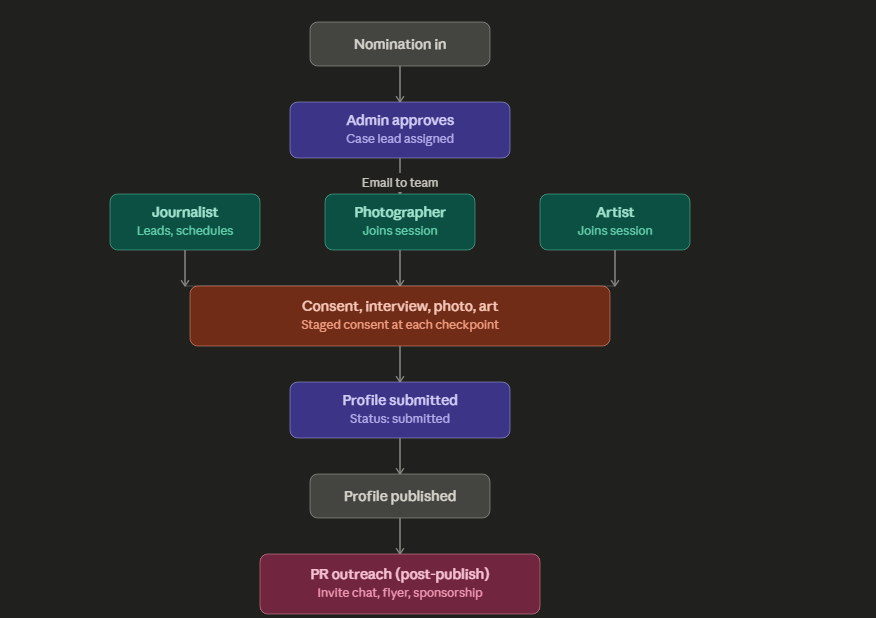

# Club Roles: Permissions Spec

*Written August 2026. This spec started as the design for moving Now We See You from one founder doing every job to a chapter that can be run by a club of students. The database layer, role assignment, Club Dashboard, email workflow, and role-scoped permissions described here have now been implemented and tested. I kept the original design decisions in this document because some of the things I expected to build changed once I actually tried to make the workflow work.*

Check out my retrospective: [`docs/retrospective-one-person-to-club.md`](./retrospective-one-person-to-club.md).

**Related documents:**

- Chapter onboarding guide: [`docs/start-a-chapter-guide.md`](./start-a-chapter-guide.md) — step-by-step guide for launching Now We See You at a new school or community
- Roles and nomination workflow diagram: [`docs/assets/roles-and-nomination-workflow-jul2026.png`](./assets/roles-and-nomination-workflow-jul2026.png)



## Admin dashboard today

When I first wrote this spec, the admin dashboard had five tabs and every action required full admin access.

That is no longer how the platform works.

The admin dashboard now has six main tabs:

| Feature | What it does today |
|---|---|
| Nominations | Review incoming nominations, approve them, assign journalist/photographer/artist roles, update status, and manage internal notes |
| Profiles | Create, review, edit, publish, and unpublish staff profiles |
| Manage Admins | Add or remove school administrator accounts |
| Manage Roles | Add or remove Journalist, Photographer, Artist, and Community Outreach roles |
| Analytics | View page views, QR scans, appreciation activity, and engagement data |
| Flyer Generator | Generate print-ready tracked QR placards for published profiles |

Creative club members do not need full admin access anymore.

Journalists, photographers, and artists sign in through the same **Club & Admin Access** page but are routed to a separate `/club` dashboard showing the nominations assigned to them.

Community Outreach uses the existing admin route only for its restricted Flyer Generator access and does not get the rest of the administrator dashboard.

This was the main reason for building the role system in the first place: someone should not need permission to approve nominations or manage administrators just because they need to upload a photograph or generate a flyer.

## What's changing

This section originally described what I planned to build.

The main idea stayed the same: Now We See You needed role-scoped access so nominations could move through a club of students — journalist, photographer, artist, community outreach — instead of everything routing through one admin account.

The implementation changed in an important way once I worked through the real workflow.

The journalist does **not** publish the profile.

The journalist creates and edits the draft. Publishing stays with an administrator.

### Role permission matrix

| Role | Can see | Can do |
|---|---|---|
| Journalist | Assigned nominations and their linked draft profiles/media | Create and edit the write-up, add featured quote and Staff Reflection information, manage draft portrait/additional media, generate or refresh the tracked profile QR |
| Photographer | Assigned nominations | Upload additional photographs; remove their allowed draft photography before publication |
| Artist | Assigned nominations | Upload portrait artwork; remove their allowed draft portrait before publication |
| Community Outreach | Published profiles for their school | Generate flyers for published profiles |
| Admin | School-scoped nominations, profiles, roles, analytics, and settings | Approve nominations, assign roles, review work, manage profiles, and publish/unpublish profiles |

Publishing is intentionally administrator-only.

That restriction is enforced at the database level rather than relying only on whether a Publish button is visible in the interface.

### Multiplicity

A school can have any number of journalists, photographers, artists, and Community Outreach members.

The same person can also hold more than one role.

This turned out to matter much more than I expected when I first wrote the design. An early chapter may not have four different students available for every profile. I might be the journalist and artist on the same nomination, for example.

The Club Dashboard therefore checks **all** matching assignments for a user rather than stopping after it finds the first role.

The same user cannot hold the same role twice at the same school, and the same email cannot be invited twice for the same role at the same school.

Per nomination, there is still one journalist assignment, one photographer assignment, and one artist assignment, but the same person can occupy more than one of those assignments.

### Current workflow, tied to existing admin features

The active workflow now works like this:

1. **Nomination comes in** → status is `pending`. Admin reviews it in the Nominations tab.

2. **Admin approves and assigns** → admin can assign a journalist, photographer, and artist while approving the nomination. Status becomes `approved`.

3. **Creative work can start immediately** → the artist and photographer do **not** have to wait for the journalist to create a profile first.

   Portraits and additional photography are linked to the nomination itself, so creative work can exist before the profile does.

4. **Journalist starts the write-up** → the journalist's first save creates a linked profile with `draft` status.

   At that point the nomination moves to `in_progress`.

5. **The team continues working** → journalist, artist, and photographer see the same assigned nomination through role-scoped access.

   The journalist can edit the story, featured quote, and optional Staff Reflection information.

   The artist and photographer can manage the creative work allowed for their roles.

6. **Journalist can generate the tracked QR** once the draft profile exists.

   QR generation uses the saved profile slug and the tracked redirect system so scans continue to appear in analytics.

7. **Admin reviews and publishes** → publication is the administrator checkpoint.

   When the linked profile becomes published, the linked nomination is synchronized to `published`.

8. **Community Outreach can use the Flyer Generator** for any published profile at that school.

The active path is therefore:

```text
pending → approved → in_progress → published
```

The database enum also contains `assigned` and `submitted` because they were part of the earlier workflow design. They remain valid status values, but they are not part of the current main UI path.

## Decisions

### Journalist publishing changed

My original decision in this document was:

> Journalist-publish stays ungated.

I changed that decision while implementing the Club Dashboard.

The simpler model would have let the journalist who finished the profile also publish it. Once I thought about the platform being run by multiple students instead of only me, that stopped feeling like the right boundary.

A journalist should be able to do real work without needing an administrator to type it for them.

But publishing is different because it changes what the public sees about another person.

The final rule is:

**Journalist can create and edit. Admin publishes.**

I also made the restriction part of the database permissions rather than just hiding a Publish button. That way a frontend mistake cannot accidentally turn a journalist into a publisher.

### Community Outreach's flyer access is school-wide, not per-profile

This decision stayed the same.

Community Outreach can generate a flyer for any published profile at their school, not just the ones they were emailed about.

That keeps the permission school-scoped rather than creating a separate per-profile outreach assignment system.

Community Outreach does not get access to Nominations, Profiles, Manage Admins, Manage Roles, or Analytics just because they can generate flyers.

### No separate `case_lead_id` field

This decision also stayed the same.

The case lead is inferred from whichever journalist is assigned to a nomination.

There is no reason to create and synchronize another field when the journalist assignment already tells us who is responsible for the write-up.

### Creative work is nomination-first

This was not obvious in the first version of this spec.

I initially thought of the profile as the container for everything: create the profile, then attach the portrait and photographs to it.

That creates an unnecessary dependency on the journalist.

In the real process, the artist might finish a portrait before the journalist finishes the interview, and the photographer may already have photographs while the write-up is still being developed.

`profile_images` therefore supports a `nomination_id` before a `profile_id` exists.

Once the profile exists, the work can still be connected to the same nomination/profile workflow.

This is a better match for how the club actually works.

## Design and architecture

### Table changes

`club_roles`

| Column | Type | Notes |
|---|---|---|
| `id` | uuid | primary key |
| `name` | text | display name for the club member |
| `email` | text | email used for invitation / role claiming |
| `user_id` | uuid | references the student's authenticated account once claimed |
| `school_id` | uuid | scopes the role to one school |
| `role` | enum | `journalist`, `photographer`, `artist`, `pr` |
| `created_at` | timestamp | creation time |
| `updated_at` | timestamp | latest update |

`nominations`

| Column | Type | Notes |
|---|---|---|
| `status` | enum | `pending`, `approved`, `assigned`, `in_progress`, `submitted`, `published` |
| `journalist_id` | uuid | references `club_roles`; also acts as the case lead |
| `photographer_id` | uuid | references `club_roles` |
| `artist_id` | uuid | references `club_roles` |

The current user-facing workflow uses:

```text
pending → approved → in_progress → published
```

`assigned` and `submitted` remain in the enum because they were added during the first workflow design, but they are not currently required transitions.

The role system does not require a separate role column on `profiles`.

Profiles connect to the workflow through their `school_id` and `nomination_id`, while role permissions are resolved through the user's school role and nomination assignment.

Creative assets can also connect through `nomination_id`, which allows the Artist and Photographer workflows to start before a profile exists.

### Original schema sketch

This was the schema sketch I wrote when designing the feature. The migrations in `supabase/migrations/` are the source of truth for the actual production schema, but I am keeping this here because it shows the original design.

```sql
-- 1. Enums

CREATE TYPE public.club_role AS ENUM (
  'journalist',
  'photographer',
  'artist',
  'pr'
);

CREATE TYPE public.nomination_status AS ENUM (
  'pending',
  'approved',
  'assigned',
  'in_progress',
  'submitted',
  'published'
);

-- 2. New club_roles table

CREATE TABLE public.club_roles (
  id uuid PRIMARY KEY DEFAULT gen_random_uuid(),
  email text,
  user_id uuid REFERENCES auth.users(id) ON DELETE CASCADE,
  school_id uuid NOT NULL REFERENCES public.schools(id) ON DELETE CASCADE,
  role public.club_role NOT NULL,
  created_at timestamp with time zone NOT NULL DEFAULT now(),
  updated_at timestamp with time zone NOT NULL DEFAULT now(),
  CONSTRAINT user_or_email_present
    CHECK (user_id IS NOT NULL OR email IS NOT NULL)
);

GRANT SELECT, INSERT, UPDATE, DELETE
ON public.club_roles TO authenticated;

GRANT ALL
ON public.club_roles TO service_role;

ALTER TABLE public.club_roles ENABLE ROW LEVEL SECURITY;

CREATE UNIQUE INDEX club_roles_user_id_school_id_role_key
  ON public.club_roles (user_id, school_id, role);

CREATE UNIQUE INDEX club_roles_school_role_email_uniq
  ON public.club_roles (school_id, role, lower(email))
  WHERE email IS NOT NULL;

CREATE INDEX club_roles_email_idx
  ON public.club_roles (lower(email));

CREATE INDEX club_roles_school_role_idx
  ON public.club_roles (school_id, role);

-- 3. Additions to nominations

ALTER TABLE public.nominations
  ADD COLUMN status public.nomination_status
    NOT NULL DEFAULT 'pending',
  ADD COLUMN journalist_id uuid
    REFERENCES public.club_roles(id) ON DELETE SET NULL,
  ADD COLUMN photographer_id uuid
    REFERENCES public.club_roles(id) ON DELETE SET NULL,
  ADD COLUMN artist_id uuid
    REFERENCES public.club_roles(id) ON DELETE SET NULL;
```

The implementation evolved through later migrations, including invite claiming, journalist profile permissions, nomination-first media, media deletion, QR generation, and profile/nomination status synchronization.

### RLS policy changes

The important part of the role system is that permissions are not only frontend rules.

The current model uses Row Level Security and database checks to enforce the boundaries.

- `club_roles`: members can resolve their own roles; administrators can manage roles for their school; global administrators can work across schools.
- `nominations`: journalist/photographer/artist access is limited to nominations where the user's role row is actually assigned.
- `profiles`: an assigned journalist can create and edit the linked draft profile but cannot publish it.
- `profile_images`: assigned creative roles can work with the media types allowed for their role, including nomination-level media before a profile exists.
- Published creative work is no longer deletable by Club members.
- Community Outreach gets the access needed for published-profile flyer generation without receiving normal administrator permissions.
- Administrator access stays school-scoped, with global-admin behavior handled separately.

This was one of the places where building the role system and the multi-school system at the same time helped. Both depend on the same basic rule:

**first determine the school, then determine what this user is allowed to do inside that school.**

### Media permissions

The final media rules are more specific than the first design.

Before publication:

- **Artist** can remove portrait artwork for an assigned nomination.
- **Photographer** can remove additional photography for an assigned nomination.
- **Journalist** can remove either portrait or additional photography for an assigned nomination because the journalist is responsible for assembling the final draft.
- A person assigned to more than one role receives the combined permissions for those roles.

After publication:

- Club members cannot delete published profile media.
- Administrators retain the profile-management workflow.

Deletion removes both the `profile_images` row and, where possible, the corresponding file in Supabase Storage.

### Journalist profile and QR workflow

The journalist role became larger than what I originally wrote in this spec.

An assigned journalist can now create the linked draft profile directly from the Club Dashboard.

The write-up form includes:

- name
- public slug
- role
- department
- featured quote
- story
- optional Staff Reflection quote
- optional Staff Reflection video URL
- optional reflection recording date

The first save creates the draft and changes the nomination to `in_progress`.

Once a profile exists, the journalist can also generate its tracked QR code.

QR generation uses the **saved** slug. If the journalist changes the slug in the form without saving it first, the dashboard stops QR generation and asks them to save before regenerating the QR.

That avoids producing a physical QR for a stale URL.

A journalist also cannot regenerate the QR while the profile is published. An administrator must first move it back out of the published state.

### Triggers / automation

The role workflow includes automated behavior around the major transitions.

- Approval and assignment can notify the assigned team members.
- Pending email-based `club_roles` invitations can be claimed when the invited person signs in with the matching account.
- The journalist's first linked draft moves an approved nomination to `in_progress`.
- Publishing a linked profile synchronizes its nomination to `published`.
- Unpublishing returns the linked nomination to active work rather than leaving the nomination marked published.
- QR generation creates or reuses a tracked redirect and stores the generated QR as profile media.
- Community Outreach can be notified when published work is ready for outreach.

The important workflow transitions are enforced in the application/database rather than depending on someone remembering to update several records manually.

### Admin dashboard changes

These were originally listed as future work. They are now implemented.

- **Manage Roles** is its own admin tab.
- Admin can add Journalist, Photographer, Artist, and Community Outreach roles for the selected school.
- Nominations can be assigned to Journalist, Photographer, and Artist role rows.
- **Approve & Assign** saves those assignments while moving the nomination to `approved`.
- Flyer Generator allows either an administrator or a user with the school's `pr` role.
- A PR-only user is routed into the restricted Flyer Generator experience rather than receiving the full admin dashboard.
- Global administrators can switch schools; school administrators stay scoped to their own school.

## Original implementation plan

This was the rough order I originally expected the work to happen in:

1. Create `club_roles` table + migration.
2. Add `status`, `journalist_id`, `photographer_id`, `artist_id` columns to `nominations`.
3. Write and test the role RLS policies.
4. Build email events around assignment and publication.
5. Add role-assignment UI to admin dashboard.
6. Update Nominations tab to assign photographer and artist at approval.
7. Update Flyer Generator's access check to include the `pr` role.
8. Build the student `/club` dashboard.
9. End-to-end test the full workflow.

The first database version came together roughly in that order.

The part I underestimated was everything after step 8.

Building a Club Dashboard exposed workflow questions that were not visible when the roles only existed as rows in a database.

For example:

- What if the same student has multiple roles?
- What can the artist do before the journalist starts?
- Who can replace a bad upload?
- What happens to the nomination when the journalist starts writing?
- Who creates the QR?
- What happens if the journalist changes the slug?
- Can a club member delete media after publication?
- Who has the final publishing authority?

Those questions created several smaller implementation steps that were not in the original plan.

## Final implementation status

### Done

- `club_roles` table and `club_role` enum.
- `nomination_status` enum.
- `journalist_id`, `photographer_id`, and `artist_id` assignments on nominations.
- School-scoped role management.
- Manage Roles UI.
- Admin assignment controls in the Nominations workflow.
- Email-based role invitation and account claiming.
- Separate `/club` dashboard.
- Support for users holding multiple roles.
- Nomination-first portrait and photography uploads.
- Journalist-created linked draft profiles.
- Automatic move to `in_progress` when the first write-up is saved.
- Staff Reflection fields in the journalist workflow.
- Role-scoped draft media deletion.
- Published-media protection for Club members.
- Journalist tracked QR generation.
- Community Outreach access to the school-wide Flyer Generator.
- Admin-only publication.
- Database enforcement preventing journalists from publishing.
- Profile-to-nomination publication synchronization.
- School-scoped and global-admin access rules.
- End-to-end workflow testing.

### Current active status path

```text
pending
   ↓
approved
   ↓
in_progress
   ↓
published
```

The `assigned` and `submitted` values remain available in the database enum but are not separate required stages in the current application.

## What changed from the first design

The biggest change was publication.

The first version of this document deliberately gave the journalist the ability to publish. I thought staged participant consent was enough of a safeguard and that adding another administrator step would slow the club down.

After implementing the workflow, I changed my mind.

The whole point of the role system is to stop the project depending on one person having every permission.

Letting the journalist both create the public story and decide when it becomes public would rebuild that same problem inside a different role.

So the final system separates **creation** from **publication**.

The second big change was realizing that the profile cannot be the thing that starts everybody else's work.

The artist and photographer need to be able to start from the approved nomination itself.

Those two changes — admin publication and nomination-first creative work — were not cosmetic UI decisions. They changed the database permissions and the shape of the workflow.

That is probably the most useful thing I learned from this feature: a permissions model can look completely reasonable on paper and still be wrong once you try to use it as an actual team.

---

## Related resources

- **Chapter onboarding guide** — [`docs/start-a-chapter-guide.md`](./start-a-chapter-guide.md)  
  Step-by-step instructions for launching Now We See You at a new school or community, including how to set up admin accounts, onboard the first staff member, and hand off to a student club.

- **Roles and nomination workflow diagram** — [`docs/assets/roles-and-nomination-workflow-jul2026.png`](./assets/roles-and-nomination-workflow-jul2026.png)  
  Visual overview of the original role and nomination workflow. The core role structure still applies, although the final implementation now keeps publishing with the administrator and allows Artist/Photographer work to begin directly from the approved nomination.