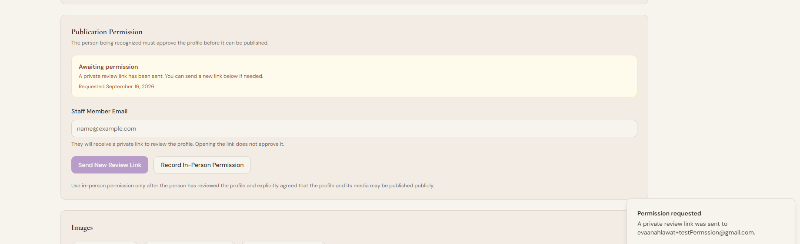
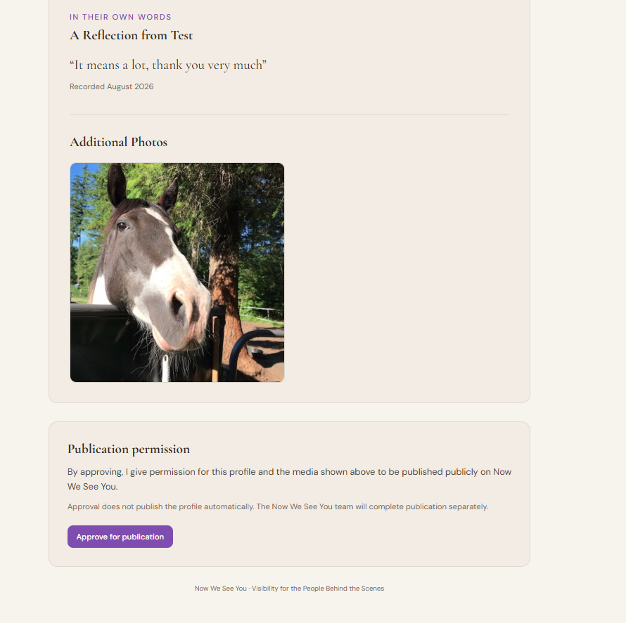
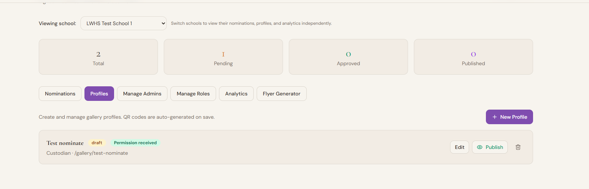

# Profile Publication Consent - Technical Design

**Project:** Now We See You  
**Date:** September 2026  
**Status:** Implemented and Tested

## Why this exists

Now We See You tells stories about real people.

Early versions of the project treated publication mainly as an administrative
decision. An administrator could move a completed profile from draft to
published.

As the project grew, that felt incomplete.

A profile can contain a person's name, role, portrait, story, photographs,
quotes, and recorded reflection. The person being recognized should have a
meaningful opportunity to see that material and decide whether they are
comfortable having it published.

The publication workflow was therefore changed so that permission from the
person being profiled becomes part of the system itself.

The core rule is:

> A new profile cannot be published until permission from the person being
> recognized has been recorded.

This is not only a user-interface rule. It is enforced by the database.

## Product principle

Recognition should not remove the agency of the person being recognized.

Now We See You is designed to make people more visible, but visibility should
not mean that somebody else gets to decide what becomes public about them.

The consent workflow separates three actions:

1. Students and contributors create the profile.
2. The person being recognized approves publication.
3. An administrator publishes the profile.

Approval and publication are intentionally different actions.

## Workflow

### Email approval

```text
Draft profile
      |
      v
Admin requests permission
      |
      v
Secure review link emailed to subject
      |
      v
Subject reviews profile and media
      |
      v
Subject approves publication
      |
      v
Permission recorded
      |
      v
Admin may publish

## Implemented workflow evidence

The consent workflow was implemented and tested end to end in September 2026.
The end-to-end regression results are recorded in [`../test.md`](../test.md).

### Permission requested

After an administrator sends the private review link, the profile remains a draft and the administrator sees an `Awaiting permission` state.



### Private review and approval

The person being recognized can open a private review page without creating an account. The page shows the profile content and media before asking for explicit publication permission.



### Permission received, publication still separate

After approval, the administrator sees `Permission received` and the Publish action becomes available. Approval itself does not publish the profile.

