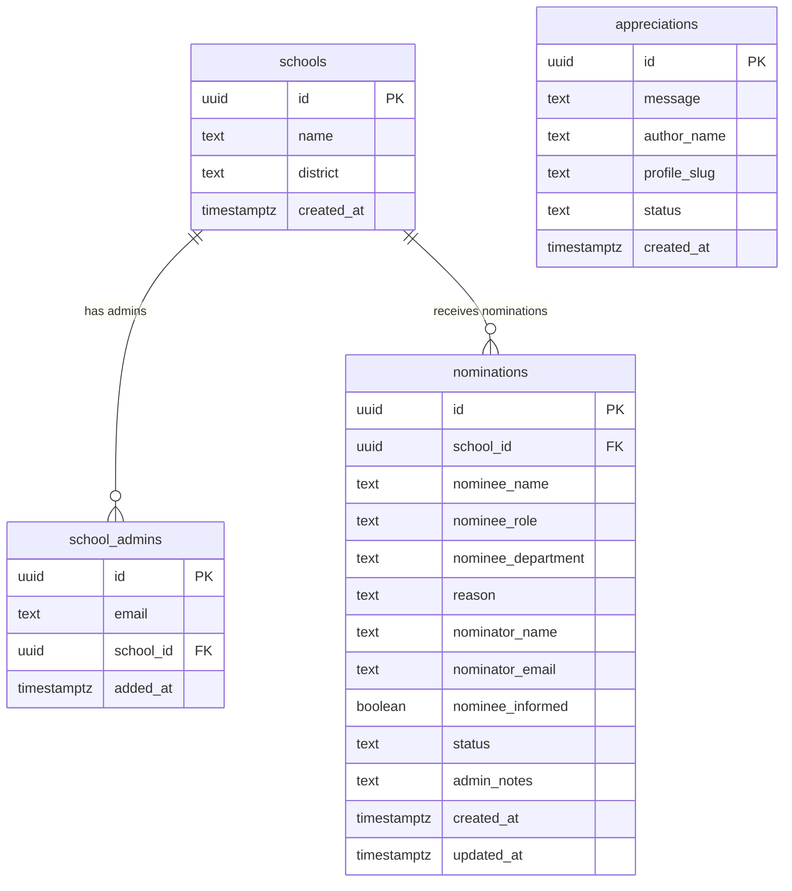
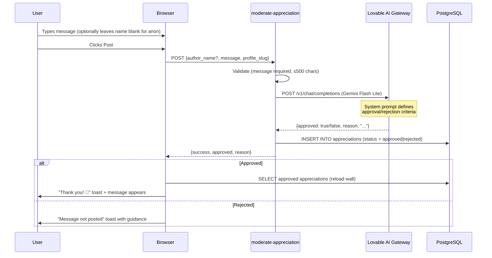
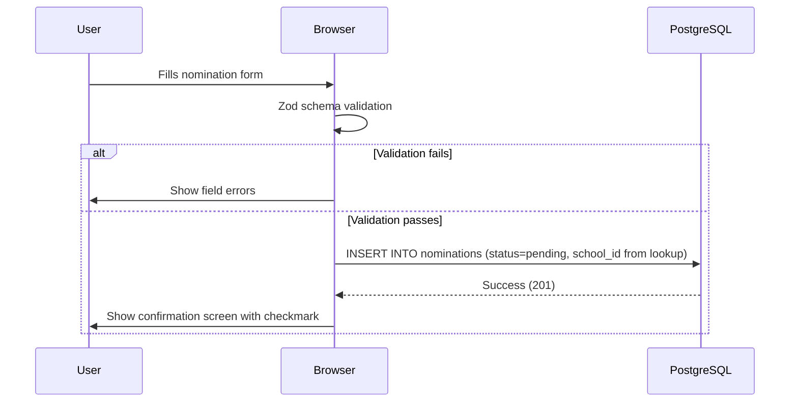
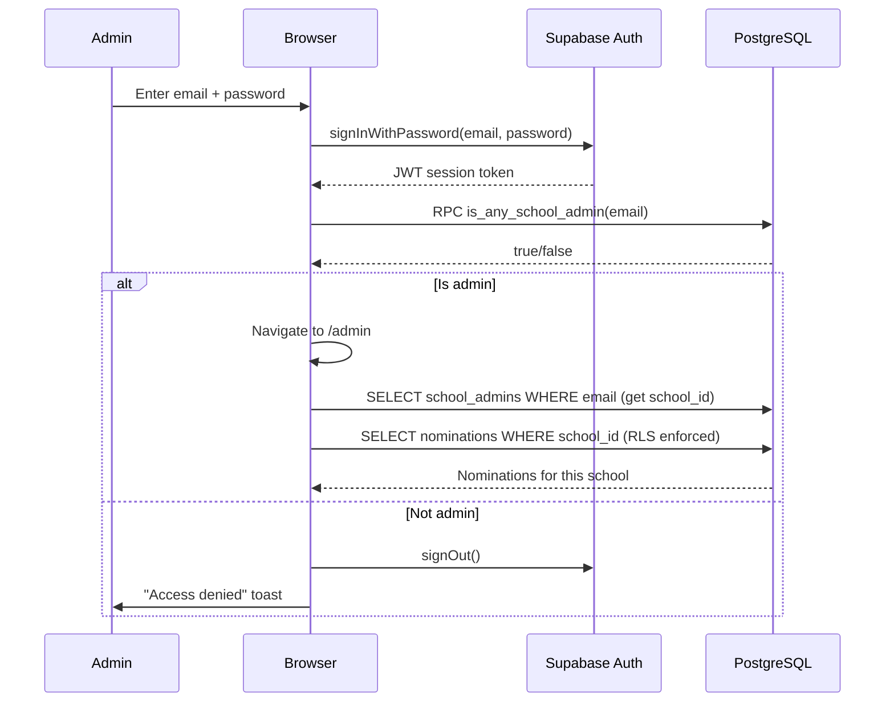
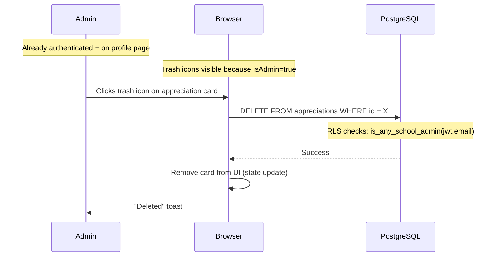
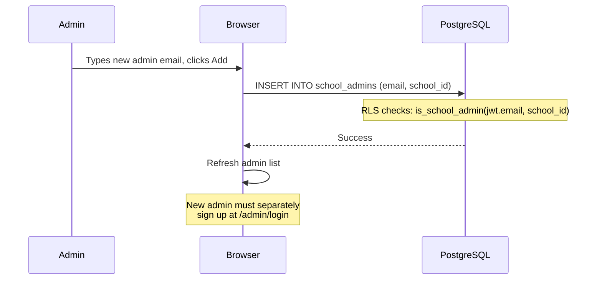

# Now We See You — Technical Design Document

**Version:** 2.0  
**Date:** March 24, 2026  
**Author:** Evaan Ahlawat  

---

## Table of Contents

1. [System Overview](#1-system-overview)
2. [Frontend Architecture](#2-frontend-architecture)
3. [Backend Architecture](#3-backend-architecture)
4. [Database Design](#4-database-design)
5. [Storage Design](#5-storage-design)
6. [Authentication & Authorization — Deep Dive](#6-authentication--authorization--deep-dive)
7. [Admin Workflows — Deep Dive](#7-admin-workflows--deep-dive)
8. [Data Flow Diagrams](#8-data-flow-diagrams)
9. [Extensibility & Expansion Guide](#9-extensibility--expansion-guide)
10. [Environment Setup](#10-environment-setup)
11. [Known Gaps / Risks / Technical Debt](#11-known-gaps--risks--technical-debt)
12. [Appendix A: SQL Schema](#appendix-a-sql-schema)
13. [Appendix B: API Contracts](#appendix-b-api-contracts)
14. [Appendix C: Secrets & External Integrations](#appendix-c-secrets--external-integrations)
15. [Appendix D: Mermaid Diagrams (copy into any Mermaid renderer)](#appendix-d-mermaid-diagrams)

---

## 1. System Overview

**Now We See You** is a student-led web application that celebrates unsung school heroes — custodians, cafeteria workers, aides, and other support staff. The platform allows:

- **Students/community** to nominate staff members for recognition
- **Students/community** to leave AI-moderated appreciation messages (including anonymous posts) on featured profiles
- **School admins** to review nominations, manage other admins, moderate content, and delete inappropriate appreciation messages

### Tech Stack

| Layer | Technology |
|-------|-----------|
| Frontend | React 18, TypeScript, Vite 8, Tailwind CSS 3 |
| UI Library | shadcn/ui (Radix primitives) |
| Animation | Framer Motion 12 |
| Forms | react-hook-form + Zod |
| Server State | @tanstack/react-query (QueryClient provisioned) |
| Backend | Lovable Cloud (Supabase-backed) |
| Database | PostgreSQL (via Supabase) |
| Auth | Supabase Auth (email/password) |
| Edge Functions | Deno (Supabase Edge Functions) |
| AI Moderation | Lovable AI Gateway (Google Gemini 2.5 Flash Lite) |
| Analytics | Google Analytics 4 (G-Y5B9N202G7) |

### Design System

| Property | Value |
|----------|-------|
| Display Font | Cormorant Garamond (400–700, italic) |
| Body Font | DM Sans (300–600) |
| Background | Warm cream `hsl(40, 40%, 95%)` |
| Primary Text | Deep charcoal `hsl(25, 12%, 18%)` |
| Accent / Secondary | Lilac-purple `hsl(270, 40%, 50%)` |
| Card Background | `hsl(38, 35%, 92%)` |
| Muted Text | `hsl(25, 8%, 42%)` |

### High-Level Architecture

```
┌─────────────────────────────────────────────────────┐
│                    BROWSER                          │
│  React SPA (Vite)                                   │
│  ┌──────────┐ ┌──────────┐ ┌───────────────────┐   │
│  │  Pages   │ │Components│ │ Supabase JS SDK   │   │
│  └──────────┘ └──────────┘ └─────────┬─────────┘   │
│                                      │              │
│  ┌────────────────────────────────┐  │              │
│  │  Google Analytics (gtag.js)   │  │              │
│  └────────────────────────────────┘  │              │
└──────────────────────────────────────┼──────────────┘
                                       │ HTTPS
                    ┌──────────────────┼──────────────┐
                    │         LOVABLE CLOUD            │
                    │                  │                │
                    │  ┌───────────────▼────────────┐  │
                    │  │     PostgREST API          │  │
                    │  │  (auto-generated REST)     │  │
                    │  └───────────────┬────────────┘  │
                    │                  │                │
                    │  ┌───────────────▼────────────┐  │
                    │  │     PostgreSQL Database     │  │
                    │  │  (RLS-protected tables)     │  │
                    │  └────────────────────────────┘  │
                    │                                   │
                    │  ┌────────────────────────────┐  │
                    │  │   Supabase Auth Service    │  │
                    │  │  (email/password)          │  │
                    │  └────────────────────────────┘  │
                    │                                   │
                    │  ┌────────────────────────────┐  │
                    │  │   Edge Functions (Deno)    │  │
                    │  │  moderate-appreciation     │──┼──► Lovable AI Gateway
                    │  └────────────────────────────┘  │
                    └──────────────────────────────────┘
```

---

## 2. Frontend Architecture

### 2.1 Pages

| Route | Component | Auth Required | Purpose |
|-------|-----------|:------------:|---------|
| `/` | `Index.tsx` | No | Landing — hero image, mission statement, featured profiles grid |
| `/gallery` | `Gallery.tsx` | No | Grid of all featured staff |
| `/gallery/brad-fisher` | `BradFisher.tsx` | No | Individual profile + QR code + appreciation wall |
| `/about` | `About.tsx` | No | About the project creator (with QR code) |
| `/nominate` | `Nominate.tsx` | No | Public nomination form (Zod-validated) |
| `/privacy` | `Privacy.tsx` | No | Privacy & ethics policy |
| `/admin/login` | `AdminLogin.tsx` | No (redirects if already authed) | Admin sign-in/sign-up |
| `/admin` | `Admin.tsx` | Yes (admin) | Dashboard for nominations & admin management |
| `*` | `NotFound.tsx` | No | 404 fallback |

### 2.2 Major Components

| Component | File | Responsibility |
|-----------|------|---------------|
| `Layout` | `Layout.tsx` | Shared shell wrapping Navbar + Footer |
| `Navbar` | `Navbar.tsx` | Responsive navigation; "Who Am I" hidden on desktop, shown in mobile menu |
| `Footer` | `Footer.tsx` | Site footer |
| `AnimatedSection` | `AnimatedSection.tsx` | Framer Motion scroll-reveal wrapper |
| `AppreciationWall` | `AppreciationWall.tsx` | Appreciation form (supports anonymous posts) + message grid + admin delete (trash icon) |
| `NavLink` | `NavLink.tsx` | Active-state navigation link helper |

### 2.3 Navigation

**Desktop nav links:** Home, Gallery, Nominate, Privacy & Ethics  
**Mobile nav links:** Home, Gallery, Who Am I, Nominate, Privacy & Ethics  

The "Who Am I" link is intentionally hidden on desktop but accessible via mobile hamburger menu and linked from the home page.

### 2.4 Routing

- Uses `react-router-dom` v6 with `BrowserRouter`
- All routes defined in `App.tsx` as flat `<Route>` elements
- No nested route layouts or `<Outlet>` usage
- No route guards/wrappers — admin protection is **imperative** (redirect in `useEffect`)

### 2.5 State Management

| Type | Mechanism | Notes |
|------|-----------|-------|
| Server state | Direct `useState`/`useEffect` + Supabase SDK | `react-query` QueryClient exists but is underutilized |
| Form state | `react-hook-form` + Zod | Used on Nominate page |
| Auth state | Checked on-demand via `supabase.auth.getSession()` | No global auth context/provider |
| UI state | Local `useState` | Menu open, loading flags, etc. |

---

## 3. Backend Architecture

### 3.1 Auto-Generated REST API (PostgREST)

All database operations use the Supabase JS SDK, which calls auto-generated REST endpoints. Security is enforced via Row-Level Security (RLS) policies on every table.

| Operation | Table | Caller | SDK Call |
|-----------|-------|--------|----------|
| `INSERT` | `nominations` | Public | `supabase.from("nominations").insert(...)` |
| `SELECT` | `nominations` | School admin | `supabase.from("nominations").select(...)` |
| `UPDATE` | `nominations` | School admin | `supabase.from("nominations").update(...)` |
| `SELECT` | `appreciations` | Public/Admin | `supabase.from("appreciations").select(...)` |
| `DELETE` | `appreciations` | Admin | `supabase.from("appreciations").delete(...)` |
| `SELECT` | `schools` | Public | `supabase.from("schools").select(...)` |
| `SELECT` | `school_admins` | School admin | `supabase.from("school_admins").select(...)` |
| `INSERT` | `school_admins` | School admin | `supabase.from("school_admins").insert(...)` |
| `DELETE` | `school_admins` | School admin | `supabase.from("school_admins").delete(...)` |

### 3.2 Edge Functions

#### `moderate-appreciation`

| Property | Value |
|----------|-------|
| Runtime | Deno (Supabase Edge Functions) |
| Trigger | Client-side invocation via `supabase.functions.invoke()` |
| Auth | Uses `SUPABASE_SERVICE_ROLE_KEY` to bypass RLS |
| AI Model | `google/gemini-2.5-flash-lite` via Lovable AI Gateway |

**Logic:**
1. Parse `{ author_name?, message, profile_slug }` from request body
2. Validate: message required, ≤500 chars
3. Call AI gateway with system prompt defining approval/rejection criteria
4. Parse AI JSON response `{ approved: bool, reason: string }`
5. If approved → insert into `appreciations` with `status = "approved"`
6. If rejected → insert into `appreciations` with `status = "rejected"`
7. Return result to client with reason

**Rejection UX:** When a message is rejected, the user sees: *"This message wasn't posted as it doesn't appear to be positive or appreciative. Please try again with a kinder message."*

**Anonymous posting:** If `author_name` is empty/null, the appreciation is posted as "Anonymous" on the wall.

### 3.3 Database Functions (RPC)

| Function | Signature | Security | Purpose |
|----------|-----------|----------|---------|
| `is_any_school_admin` | `(_email text) → boolean` | `SECURITY DEFINER` | Check if email exists in any school's admin list |
| `is_school_admin` | `(_email text, _school_id uuid) → boolean` | `SECURITY DEFINER` | Check if email is admin for a specific school |
| `update_updated_at_column` | `() → trigger` | — | Auto-update `updated_at` on row change |

Both admin-check functions use `SECURITY DEFINER` to bypass RLS and prevent recursive policy evaluation.

### 3.4 Notification Logic

**Currently not implemented.** No email, push, or in-app notifications exist. This is identified as a gap in Section 11.

---

## 4. Database Design

### 4.1 Entity-Relationship Diagram (Mermaid)



### 4.2 Table Details

#### `schools`

| Column | Type | Nullable | Default | Notes |
|--------|------|:--------:|---------|-------|
| `id` | `uuid` | No | `gen_random_uuid()` | Primary key |
| `name` | `text` | No | — | School name |
| `district` | `text` | No | `'Lake Washington School District'` | District name |
| `created_at` | `timestamptz` | No | `now()` | Creation timestamp |

#### `school_admins`

| Column | Type | Nullable | Default | Notes |
|--------|------|:--------:|---------|-------|
| `id` | `uuid` | No | `gen_random_uuid()` | Primary key |
| `email` | `text` | No | — | Admin's email (lowercased in queries) |
| `school_id` | `uuid` | No | — | FK → `schools.id` |
| `added_at` | `timestamptz` | No | `now()` | When admin was added |

#### `nominations`

| Column | Type | Nullable | Default | Notes |
|--------|------|:--------:|---------|-------|
| `id` | `uuid` | No | `gen_random_uuid()` | Primary key |
| `school_id` | `uuid` | No | — | FK → `schools.id` |
| `nominee_name` | `text` | No | — | Name of person nominated |
| `nominee_role` | `text` | No | — | Their role (e.g., "Head Custodian") |
| `nominee_department` | `text` | No | — | Department (e.g., "Facilities") |
| `reason` | `text` | No | — | Why they deserve recognition |
| `nominator_name` | `text` | No | — | Who submitted the nomination |
| `nominator_email` | `text` | No | — | Submitter's email |
| `nominee_informed` | `boolean` | No | `false` | Whether nominee knows about it |
| `status` | `text` | No | `'pending'` | pending / approved / declined / featured |
| `admin_notes` | `text` | Yes | — | Internal admin notes |
| `created_at` | `timestamptz` | No | `now()` | Submission time |
| `updated_at` | `timestamptz` | No | `now()` | Last update (auto-updated via trigger) |

#### `appreciations`

| Column | Type | Nullable | Default | Notes |
|--------|------|:--------:|---------|-------|
| `id` | `uuid` | No | `gen_random_uuid()` | Primary key |
| `message` | `text` | No | — | The appreciation text |
| `author_name` | `text` | Yes | — | Null = anonymous (displayed as "Anonymous" on wall) |
| `profile_slug` | `text` | No | — | Soft link to profile page route |
| `status` | `text` | No | `'pending'` | pending / approved / rejected |
| `created_at` | `timestamptz` | No | `now()` | When posted |

### 4.3 Foreign Keys

| From | To | On Delete |
|------|----|-----------|
| `school_admins.school_id` | `schools.id` | (default — no cascade specified) |
| `nominations.school_id` | `schools.id` | (default — no cascade specified) |

### 4.4 Indexes

Only default primary key indexes exist. No additional indexes on:
- `appreciations.profile_slug` (should be indexed)
- `appreciations.status` (should be indexed)
- `nominations.school_id` (should be indexed)
- `nominations.status` (should be indexed)
- `school_admins.email` (should be indexed)

### 4.5 Row-Level Security Policies

#### `schools`
| Policy | Command | Roles | Condition |
|--------|---------|-------|-----------|
| Schools are viewable by everyone | SELECT | public | `true` |

#### `school_admins`
| Policy | Command | Roles | Condition |
|--------|---------|-------|-----------|
| Admins can view their school admins | SELECT | public | `is_school_admin(jwt.email, school_id)` |
| Admins can add admins to their school | INSERT | public | `is_school_admin(jwt.email, school_id)` |
| Admins can remove admins from their school | DELETE | public | `is_school_admin(jwt.email, school_id)` |

#### `nominations`
| Policy | Command | Roles | Condition |
|--------|---------|-------|-----------|
| Anyone can submit nominations | INSERT | public | `true` |
| Admins can view their school nominations | SELECT | public | `is_school_admin(jwt.email, school_id)` |
| Admins can update their school nominations | UPDATE | public | `is_school_admin(jwt.email, school_id)` |

#### `appreciations`
| Policy | Command | Roles | Condition |
|--------|---------|-------|-----------|
| Anyone can submit appreciations | INSERT | public | `true` |
| Approved appreciations are public | SELECT | public | `status = 'approved'` |
| Admins can view all appreciations | SELECT | authenticated | `is_any_school_admin(jwt.email)` |
| Admins can delete appreciations | DELETE | authenticated | `is_any_school_admin(jwt.email)` |

---

## 5. Storage Design

**No storage buckets exist.** All media assets are static files committed to the repository:

| File | Location | Purpose |
|------|----------|---------|
| `brad-portrait.jpeg` | `src/assets/` | Brad Fisher's hand-drawn portrait |
| `brad-photo.jpeg` | `src/assets/` | Brad Fisher photo |
| `brad-action.jpeg` | `src/assets/` | Brad Fisher additional photo |
| `brad-qr.jpeg` | `src/assets/` | QR code linking to Brad's profile |
| `evaan-portrait.jpeg` | `src/assets/` | Project creator portrait |
| `about-qr.jpeg` | `src/assets/` | QR code for About page |
| `hero-community.jpg` | `src/assets/` | Hero section image on landing page |
| `qr-who-am-i.png` | `src/assets/` | Legacy QR code (About page) |

**Implication:** Adding new profiles requires committing new image files. A scalable solution would use a storage bucket with upload capabilities.

---

## 6. Authentication & Authorization — Deep Dive

### 6.1 Authentication Flow

```
┌─────────────────────────────────────────────────────────────┐
│                    AUTH LIFECYCLE                            │
│                                                             │
│  1. SIGN UP                                                 │
│     User → /admin/login → enters email + password           │
│     App → supabase.auth.signUp({ email, password })         │
│     Supabase → sends confirmation email                     │
│     User → clicks email link → account confirmed            │
│                                                             │
│  2. SIGN IN                                                 │
│     User → /admin/login → enters credentials                │
│     App → supabase.auth.signInWithPassword(...)             │
│     App → supabase.rpc("is_any_school_admin", { email })    │
│     ├─ TRUE  → navigate("/admin")                           │
│     └─ FALSE → supabase.auth.signOut() + "Access denied"    │
│                                                             │
│  3. SESSION CHECK (on page load)                            │
│     Admin.tsx / AdminLogin.tsx useEffect:                    │
│     App → supabase.auth.getSession()                        │
│     ├─ No session → redirect to /admin/login                │
│     └─ Has session → RPC check → allow or redirect          │
│                                                             │
│  4. SIGN OUT                                                │
│     Admin → clicks Logout button                            │
│     App → supabase.auth.signOut()                           │
│     App → navigate("/admin/login")                          │
│                                                             │
│  5. ADMIN DETECTION ON PUBLIC PAGES                         │
│     AppreciationWall checks session on mount:               │
│     supabase.auth.getSession() → if session exists →        │
│     supabase.rpc("is_any_school_admin") →                   │
│     if true → show trash icons on appreciation cards        │
└─────────────────────────────────────────────────────────────┘
```

### 6.2 Authorization Model

The system uses a **table-based admin model** (not a roles enum):

```
┌──────────────┐         ┌──────────────────┐
│  auth.users  │         │  school_admins   │
│              │         │                  │
│  id (uuid)   │◄───────▶│  email (text)    │
│  email       │  match  │  school_id (FK)  │
│              │  by     │                  │
└──────────────┘ email   └────────┬─────────┘
                                  │
                                  │ FK
                                  ▼
                         ┌──────────────────┐
                         │     schools      │
                         │                  │
                         │  id (uuid)       │
                         │  name            │
                         └──────────────────┘
```

**Key design decisions:**
- Admin status is **not** stored in `auth.users` metadata or a separate `user_roles` table
- Instead, `school_admins` table links emails to schools
- Two `SECURITY DEFINER` functions abstract the lookup and are used in RLS policies
- This means admin access is **school-scoped** — an admin for School A cannot see School B's data
- Admin detection also runs on public pages (e.g., AppreciationWall) to conditionally show moderation controls

### 6.3 Permission Matrix

| Action | Public | Authenticated (non-admin) | School Admin | Any Admin |
|--------|:------:|:------------------------:|:------------:|:---------:|
| View gallery & profiles | ✅ | ✅ | ✅ | ✅ |
| Submit nomination | ✅ | ✅ | ✅ | ✅ |
| Submit appreciation (incl. anonymous) | ✅ | ✅ | ✅ | ✅ |
| View approved appreciations | ✅ | ✅ | ✅ | ✅ |
| View ALL appreciations | ❌ | ❌ | ❌ | ✅ |
| Delete appreciations (trash icon) | ❌ | ❌ | ❌ | ✅ |
| View nominations | ❌ | ❌ | ✅ (own school) | ✅ (own school) |
| Update nomination status | ❌ | ❌ | ✅ (own school) | ✅ (own school) |
| Add/remove school admins | ❌ | ❌ | ✅ (own school) | ✅ (own school) |
| View school admins list | ❌ | ❌ | ✅ (own school) | ✅ (own school) |

### 6.4 Security Layers

```
Layer 1: Supabase Auth (JWT)
  └─ Verifies identity (email/password)

Layer 2: RPC gate (application-level)
  └─ is_any_school_admin() — blocks non-admins from reaching /admin UI

Layer 3: RLS policies (database-level)
  └─ is_school_admin() — scopes data access per school
  └─ Even if someone bypasses the UI, the DB won't return unauthorized data

Layer 4: Edge Function (service role)
  └─ moderate-appreciation uses SERVICE_ROLE_KEY
  └─ Bypasses RLS intentionally to insert moderated content

Layer 5: AI Moderation (content-level)
  └─ Gemini Flash Lite checks message intent before insertion
  └─ Rejects negative, inappropriate, or non-appreciative content
```

### 6.5 How to Expand Authentication

#### Adding New Admin Roles (e.g., Super Admin, Moderator)

**Option A: Extend school_admins with a role column**
```sql
ALTER TABLE public.school_admins ADD COLUMN role text NOT NULL DEFAULT 'admin';
-- Values: 'admin', 'moderator', 'super_admin'

-- New RPC function
CREATE FUNCTION public.has_school_role(_email text, _school_id uuid, _role text)
RETURNS boolean ...
```

**Option B: Separate user_roles table (recommended for complex RBAC)**
```sql
CREATE TYPE public.app_role AS ENUM ('admin', 'moderator', 'super_admin');

CREATE TABLE public.user_roles (
    id uuid PRIMARY KEY DEFAULT gen_random_uuid(),
    user_id uuid REFERENCES auth.users(id) ON DELETE CASCADE NOT NULL,
    role app_role NOT NULL,
    UNIQUE (user_id, role)
);

CREATE FUNCTION public.has_role(_user_id uuid, _role app_role)
RETURNS boolean
LANGUAGE sql STABLE SECURITY DEFINER
SET search_path = public
AS $$ SELECT EXISTS (
    SELECT 1 FROM public.user_roles
    WHERE user_id = _user_id AND role = _role
) $$;
```

#### Adding Social Login (Google, etc.)
1. Configure OAuth provider in Lovable Cloud auth settings
2. Add social login buttons to AdminLogin.tsx
3. Use `supabase.auth.signInWithOAuth({ provider: 'google' })`
4. Admin check remains the same (email-based)

#### Adding Password Reset
1. Add "Forgot password" link to AdminLogin.tsx
2. Call `supabase.auth.resetPasswordForEmail(email, { redirectTo: origin + '/reset-password' })`
3. Create `/reset-password` page that calls `supabase.auth.updateUser({ password })`

---

## 7. Admin Workflows — Deep Dive

### 7.1 Admin Dashboard Structure

```
/admin
├── Tab: Nominations
│   ├── List of nominations (filtered by school via RLS)
│   ├── Status badges: Pending | Approved | Declined | Featured
│   ├── Click to expand → view full details
│   ├── Update status dropdown
│   ├── Admin notes textarea
│   └── Save changes
│
└── Tab: Admins
    ├── List of current admins for the school
    ├── Add admin by email
    └── Remove admin (with confirmation)
```

### 7.2 Nomination Review Workflow

```
┌──────────────┐     ┌──────────────┐     ┌──────────────┐
│   PENDING    │────►│   APPROVED   │────►│   FEATURED   │
│              │     │              │     │ (on gallery)  │
└──────┬───────┘     └──────────────┘     └──────────────┘
       │
       │
       ▼
┌──────────────┐
│   DECLINED   │
│              │
└──────────────┘
```

**Step-by-step:**
1. Community member submits nomination at `/nominate`
2. Form validated with Zod (nominee name, role, department, reason, nominator info)
3. Row inserted into `nominations` with `status = 'pending'`
4. School admin logs in → sees pending nominations
5. Admin reviews details, adds internal notes
6. Admin sets status to `approved`, `declined`, or `featured`
7. `updated_at` auto-updated via database trigger

**Current gap:** No automated transition from "approved" nomination to a live gallery profile. This is a manual code process today.

### 7.3 Appreciation Moderation Workflow

```
User submits message (optionally anonymous)
       │
       ▼
┌──────────────────┐
│  Edge Function   │
│  Validates input │
│  (≤500 chars)    │
└────────┬─────────┘
         │
         ▼
┌──────────────────┐
│  AI Moderation   │
│  Gemini Flash    │
│  Lite model      │
└────────┬─────────┘
         │
    ┌────┴────┐
    │         │
    ▼         ▼
┌────────┐ ┌──────────┐
│APPROVED│ │ REJECTED │
│ (shown │ │ (stored  │
│ on wall│ │  but not │
│  with  │ │  shown)  │
│  toast)│ │          │
└────────┘ └──────────┘
         │
         ▼ (admin can)
    ┌──────────┐
    │ DELETED  │
    │ (removed │
    │ from DB) │
    └──────────┘
```

**Rejection message shown to user:**
> "This message wasn't posted as it doesn't appear to be positive or appreciative. Please try again with a kinder message."

**Admin moderation capabilities:**
- View all approved messages on any profile page
- Delete inappropriate messages that passed AI moderation via trash icon
- Trash icons are conditionally rendered only when admin is authenticated

### 7.4 Admin Management Workflow

```
Existing Admin
       │
       ├── Add new admin
       │   └── Enter email → INSERT into school_admins
       │       └── New admin can now log in and access dashboard
       │
       └── Remove admin
           └── Click trash icon → DELETE from school_admins
               └── Removed admin loses access immediately
```

**Important:** Adding an admin email to `school_admins` does NOT create an auth account. The new admin must separately sign up at `/admin/login`. Their email must match the one in `school_admins`.

### 7.5 Future: Create/Edit/Publish Profile Workflow (Not Yet Built)

```
┌──────────────────────────────────────────────────────┐
│  PROPOSED WORKFLOW                                   │
│                                                      │
│  1. Admin approves nomination → status = "approved"  │
│  2. Admin clicks "Create Profile" button             │
│  3. Form appears: upload portrait, write bio,        │
│     add quotes, set slug                             │
│  4. Profile saved as draft in `profiles` table       │
│  5. Admin previews profile                           │
│  6. Admin clicks "Publish"                           │
│  7. Profile appears in gallery automatically         │
│  8. Appreciation wall auto-enabled via profile_slug  │
└──────────────────────────────────────────────────────┘
```

This requires:
- A `profiles` table (id, slug, name, role, department, bio, portrait_url, status, school_id)
- A storage bucket for portrait uploads
- Dynamic profile page route (`/gallery/:slug`)
- Admin UI for profile editing

---

## 8. Data Flow Diagrams

### 8.1 Appreciation Submission (Sequence)



### 8.2 Nomination Submission (Sequence)



### 8.3 Admin Login (Sequence)



### 8.4 Admin Deletes Appreciation (Sequence)



### 8.5 Admin Adds Another Admin



---

## 9. Extensibility & Expansion Guide

### 9.1 Adding a New School

1. Insert row into `schools` table (name, district)
2. Insert initial admin into `school_admins` (email, school_id)
3. Admin signs up at `/admin/login`
4. RLS automatically scopes their data

### 9.2 Adding Dynamic Profiles (CMS)

**Required changes:**

```sql
-- New table
CREATE TABLE public.profiles (
    id uuid PRIMARY KEY DEFAULT gen_random_uuid(),
    slug text UNIQUE NOT NULL,
    name text NOT NULL,
    role text NOT NULL,
    department text,
    bio text,
    portrait_url text,
    school_id uuid REFERENCES schools(id),
    status text NOT NULL DEFAULT 'draft', -- draft, published
    nomination_id uuid REFERENCES nominations(id),
    created_at timestamptz DEFAULT now(),
    updated_at timestamptz DEFAULT now()
);

-- RLS
CREATE POLICY "Published profiles are public"
ON profiles FOR SELECT TO public
USING (status = 'published');

CREATE POLICY "Admins manage their school profiles"
ON profiles FOR ALL TO authenticated
USING (is_school_admin(auth.jwt()->>'email', school_id));
```

**Frontend changes:**
- Replace hardcoded `BradFisher.tsx` with dynamic `/gallery/:slug` route
- Fetch profile data from `profiles` table
- Admin dashboard gets "Profiles" tab for CRUD
- Storage bucket for portrait uploads

### 9.3 Adding Notifications

**Email on new nomination:**
```sql
-- Database webhook or Edge Function trigger
-- When INSERT on nominations → call edge function → send email
```

**Implementation options:**
1. Supabase Database Webhooks → Edge Function → email API (Resend, SendGrid)
2. Realtime subscription in admin dashboard for live updates
3. Daily digest edge function via pg_cron

### 9.4 Adding Rate Limiting

**At Edge Function level:**
```typescript
// In moderate-appreciation:
// Check IP-based or fingerprint-based rate limit
// Store attempts in a rate_limits table or use in-memory counter
```

### 9.5 Multi-School Gallery

Currently gallery items are hardcoded. To support multiple schools:
1. Add `school_id` to `profiles` table
2. Gallery page filters by school or shows all
3. Each school could have a subdomain or route prefix

---

## 10. Environment Setup

### 10.1 Lovable Cloud (Auto-Provisioned)

| Service | Purpose |
|---------|---------|
| PostgreSQL database | All persistent data |
| Supabase Auth | Email/password authentication |
| PostgREST API | Auto-generated REST from schema |
| Edge Functions (Deno) | Server-side logic (moderation) |
| Realtime | Available but not currently used |
| Storage | Available but not currently used |

### 10.2 Client Environment Variables (`.env` — auto-managed)

| Variable | Purpose |
|----------|---------|
| `VITE_SUPABASE_URL` | API base URL |
| `VITE_SUPABASE_PUBLISHABLE_KEY` | Anon key for client SDK |
| `VITE_SUPABASE_PROJECT_ID` | Project identifier |

### 10.3 Edge Function Secrets

| Secret | Purpose | Auto-provided |
|--------|---------|:------------:|
| `LOVABLE_API_KEY` | Lovable AI Gateway auth | Yes |
| `SUPABASE_URL` | DB access from edge functions | Yes |
| `SUPABASE_SERVICE_ROLE_KEY` | Bypass RLS in edge functions | Yes |
| `SUPABASE_ANON_KEY` | Available (unused) | Yes |
| `SUPABASE_DB_URL` | Direct DB connection | Yes |
| `SUPABASE_PUBLISHABLE_KEY` | Available (unused) | Yes |

### 10.4 External Integrations

| Service | Endpoint / ID | Purpose |
|---------|---------------|---------|
| Lovable AI Gateway | `https://ai.gateway.lovable.dev/v1/chat/completions` | Content moderation |
| Google Analytics 4 | Measurement ID: `G-Y5B9N202G7` | Website analytics & traffic tracking |

### 10.5 Google Analytics Integration

GA4 is integrated via the global `gtag.js` snippet in `index.html`. It tracks:
- Page views (automatic)
- User engagement (automatic)
- No custom events configured yet

---

## 11. Known Gaps / Risks / Technical Debt

| # | Issue | Severity | Impact | Suggested Fix |
|---|-------|----------|--------|---------------|
| 1 | No dynamic profile CMS | **High** | New profiles require code changes | Build profiles table + admin UI |
| 2 | No notification system | **Medium** | Admins must manually check for nominations | Add email via edge function + webhook |
| 3 | No global auth context | **Low** | Session checked independently per page; could lead to inconsistencies | Create AuthProvider with React Context |
| 4 | react-query underutilized | **Low** | Missing caching, deduplication, background refetch | Migrate to useQuery/useMutation hooks |
| 5 | profile_slug is a soft reference | **Medium** | No referential integrity; orphaned appreciations possible | Create profiles table with FK |
| 6 | No database indexes beyond PKs | **Low** | Slow queries at scale | Add indexes on profile_slug, school_id, status, email |
| 7 | Status fields are freeform text | **Low** | Typo risk, no DB validation | Convert to PostgreSQL enums |
| 8 | Admin signup exposed | **Low** | Anyone can create auth accounts (but can't access admin) | Hide signup, use invite-only flow |
| 9 | No rate limiting | **Medium** | Abuse via spam submissions | Add IP-based rate limits in edge function |
| 10 | No image upload capability | **Medium** | Portraits must be committed as code | Add storage bucket + upload UI |
| 11 | No password reset flow | **Low** | Admins can't recover accounts | Add forgot-password + /reset-password page |
| 12 | No audit logging | **Low** | No trail of admin actions | Add audit_log table |
| 13 | CASCADE behavior undefined | **Low** | Deleting a school may leave orphaned records | Add ON DELETE CASCADE to FKs |
| 14 | No custom GA4 events | **Low** | Limited analytics insight | Add events for nomination submit, appreciation post, admin actions |

---

## Appendix A: SQL Schema

```sql
-- =============================================
-- FULL SQL SCHEMA — Now We See You
-- Version 2.0 — March 24, 2026
-- =============================================

-- Schools
CREATE TABLE public.schools (
    id uuid PRIMARY KEY DEFAULT gen_random_uuid(),
    name text NOT NULL,
    district text NOT NULL DEFAULT 'Lake Washington School District',
    created_at timestamptz NOT NULL DEFAULT now()
);
ALTER TABLE public.schools ENABLE ROW LEVEL SECURITY;
CREATE POLICY "Schools are viewable by everyone" ON public.schools FOR SELECT TO public USING (true);

-- School Admins
CREATE TABLE public.school_admins (
    id uuid PRIMARY KEY DEFAULT gen_random_uuid(),
    email text NOT NULL,
    school_id uuid NOT NULL REFERENCES public.schools(id),
    added_at timestamptz NOT NULL DEFAULT now()
);
ALTER TABLE public.school_admins ENABLE ROW LEVEL SECURITY;
CREATE POLICY "Admins can view their school admins" ON public.school_admins FOR SELECT TO public USING (is_school_admin((auth.jwt() ->> 'email'), school_id));
CREATE POLICY "Admins can add admins to their school" ON public.school_admins FOR INSERT TO public WITH CHECK (is_school_admin((auth.jwt() ->> 'email'), school_id));
CREATE POLICY "Admins can remove admins from their school" ON public.school_admins FOR DELETE TO public USING (is_school_admin((auth.jwt() ->> 'email'), school_id));

-- Nominations
CREATE TABLE public.nominations (
    id uuid PRIMARY KEY DEFAULT gen_random_uuid(),
    school_id uuid NOT NULL REFERENCES public.schools(id),
    nominee_name text NOT NULL,
    nominee_role text NOT NULL,
    nominee_department text NOT NULL,
    reason text NOT NULL,
    nominator_name text NOT NULL,
    nominator_email text NOT NULL,
    nominee_informed boolean NOT NULL DEFAULT false,
    status text NOT NULL DEFAULT 'pending',
    admin_notes text,
    created_at timestamptz NOT NULL DEFAULT now(),
    updated_at timestamptz NOT NULL DEFAULT now()
);
ALTER TABLE public.nominations ENABLE ROW LEVEL SECURITY;
CREATE POLICY "Anyone can submit nominations" ON public.nominations FOR INSERT TO public WITH CHECK (true);
CREATE POLICY "Admins can view their school nominations" ON public.nominations FOR SELECT TO public USING (is_school_admin((auth.jwt() ->> 'email'), school_id));
CREATE POLICY "Admins can update their school nominations" ON public.nominations FOR UPDATE TO public USING (is_school_admin((auth.jwt() ->> 'email'), school_id));

-- Appreciations
CREATE TABLE public.appreciations (
    id uuid PRIMARY KEY DEFAULT gen_random_uuid(),
    message text NOT NULL,
    author_name text,
    profile_slug text NOT NULL,
    status text NOT NULL DEFAULT 'pending',
    created_at timestamptz NOT NULL DEFAULT now()
);
ALTER TABLE public.appreciations ENABLE ROW LEVEL SECURITY;
CREATE POLICY "Anyone can submit appreciations" ON public.appreciations FOR INSERT TO public WITH CHECK (true);
CREATE POLICY "Approved appreciations are public" ON public.appreciations FOR SELECT TO public USING (status = 'approved');
CREATE POLICY "Admins can view all appreciations" ON public.appreciations FOR SELECT TO authenticated USING (is_any_school_admin((auth.jwt() ->> 'email')));
CREATE POLICY "Admins can delete appreciations" ON public.appreciations FOR DELETE TO authenticated USING (is_any_school_admin((auth.jwt() ->> 'email')));

-- Functions
CREATE OR REPLACE FUNCTION public.is_any_school_admin(_email text)
RETURNS boolean LANGUAGE sql STABLE SECURITY DEFINER SET search_path = public AS $$
  SELECT EXISTS (SELECT 1 FROM public.school_admins WHERE email = lower(_email))
$$;

CREATE OR REPLACE FUNCTION public.is_school_admin(_email text, _school_id uuid)
RETURNS boolean LANGUAGE sql STABLE SECURITY DEFINER SET search_path = public AS $$
  SELECT EXISTS (SELECT 1 FROM public.school_admins WHERE email = lower(_email) AND school_id = _school_id)
$$;

CREATE OR REPLACE FUNCTION public.update_updated_at_column()
RETURNS trigger LANGUAGE plpgsql SET search_path = public AS $$
BEGIN NEW.updated_at = now(); RETURN NEW; END;
$$;
```

---

## Appendix B: API Contracts

### Edge Function: `moderate-appreciation`

**Endpoint:** `POST /functions/v1/moderate-appreciation`

**Request:**
```json
{
  "author_name": "Jane",         // optional, null/empty for anonymous
  "message": "Thank you for everything!",  // required, max 500 chars
  "profile_slug": "brad-fisher"  // required
}
```

**Response (approved):**
```json
{
  "success": true,
  "approved": true,
  "reason": "Your appreciation has been posted!"
}
```

**Response (rejected):**
```json
{
  "success": true,
  "approved": false,
  "reason": "This message wasn't posted as it doesn't appear to be positive or appreciative. Please try again with a kinder message."
}
```

**Response (error):**
```json
{
  "error": "Message and profile are required"
}
```

### Supabase SDK Examples

**Fetch approved appreciations:**
```typescript
const { data } = await supabase
  .from("appreciations")
  .select("id, author_name, message, created_at")
  .eq("profile_slug", "brad-fisher")
  .eq("status", "approved")
  .order("created_at", { ascending: false });
```

**Submit nomination:**
```typescript
const { error } = await supabase.from("nominations").insert({
  nominee_name: "Brad Fisher",
  nominee_role: "Head Custodian",
  nominee_department: "Facilities",
  reason: "Goes above and beyond every day...",
  nominator_name: "Jane Doe",
  nominator_email: "jane@school.edu",
  school_id: "uuid-here",
  nominee_informed: true,
});
```

**Admin: Update nomination status:**
```typescript
const { error } = await supabase
  .from("nominations")
  .update({ status: "approved", admin_notes: "Great candidate" })
  .eq("id", nominationId);
```

**Admin: Delete appreciation:**
```typescript
const { error } = await supabase
  .from("appreciations")
  .delete()
  .eq("id", appreciationId);
```

**Admin: Add school admin:**
```typescript
const { error } = await supabase
  .from("school_admins")
  .insert({ email: "newadmin@school.edu", school_id: schoolId });
```

---

## Appendix C: Secrets & External Integrations

| Secret Name | Location | Purpose |
|-------------|----------|---------|
| `LOVABLE_API_KEY` | Edge Function env | Authenticates with Lovable AI Gateway |
| `SUPABASE_URL` | Edge Function env | Database API URL |
| `SUPABASE_SERVICE_ROLE_KEY` | Edge Function env | Full DB access (bypasses RLS) |
| `SUPABASE_ANON_KEY` | Edge Function env | Available, unused |
| `SUPABASE_DB_URL` | Edge Function env | Direct Postgres connection string |
| `VITE_SUPABASE_URL` | Client `.env` | Client-side API URL |
| `VITE_SUPABASE_PUBLISHABLE_KEY` | Client `.env` | Client-side anon key |

| External Service | URL / ID | Auth Method | Purpose |
|-----------------|----------|-------------|---------|
| Lovable AI Gateway | `https://ai.gateway.lovable.dev/v1/chat/completions` | Bearer token (`LOVABLE_API_KEY`) | Content moderation |
| Google Analytics 4 | `G-Y5B9N202G7` | Public measurement ID | Website analytics |

---

## Appendix D: Mermaid Diagrams

All diagrams in this document use Mermaid syntax. To render them:

1. **Online:** Paste into [mermaid.live](https://mermaid.live)
2. **VS Code:** Install "Mermaid Preview" extension
3. **Notion/Confluence:** Use Mermaid code blocks
4. **Draw.io:** Import Mermaid syntax
5. **Lucidchart:** Copy diagram logic manually

### Tips for Architecture Diagrams
- Use the ERD in Section 4.1 as the base for your database diagram
- Use sequence diagrams in Section 8 as the base for flow diagrams
- The ASCII diagrams in Sections 6 and 7 can be recreated in any diagramming tool
