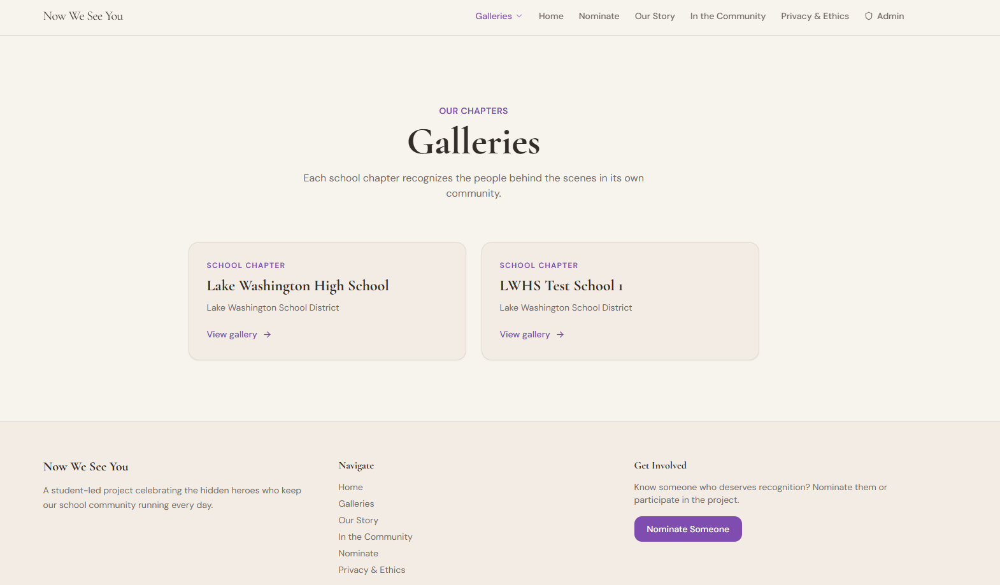
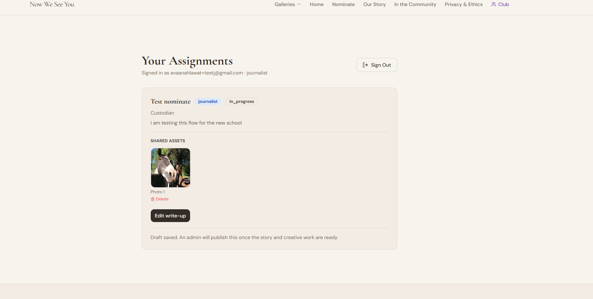
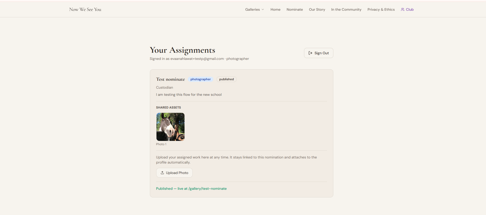

# Testing

Manual and automated verification of nowweseeyou.org.

**Last captured automated live run:** July 17, 2026  
**Latest production regression:** September 8, 2026

The July results below record tests that were actually run against the live application.

As the platform expanded, detailed feature-level testing and success criteria were also recorded in the original design documents. This file keeps the central testing history, end-to-end chapter testing, and final cross-system regression without duplicating those specifications.

---

## Automated verification

Two scripts in `scripts/` run against the live platform and database.

### Database and QR checks (`verify-live-readonly.ts`)

Verifies published profiles, redirect destinations, and QR resolution.

```json
{
  "publishedProfiles": [
    { "slug": "brad-fisher", "name": "Brad Fisher", "status": "published" },
    { "slug": "shirley-p", "name": "Shirley P.", "status": "published" },
    { "slug": "pauline-gillespie", "name": "Pauline Gillespie", "status": "published" },
    { "slug": "jose-guerrero", "name": "Jose Guerrero", "status": "published" },
    { "slug": "michele-raymer", "name": "Michele Raymer", "status": "published" },
    { "slug": "beth-da-luz", "name": "Beth Da Luz", "status": "published" }
  ],
  "redirects": [
    { "id": "beth-da-luz-flyer-4", "profile_slug": "beth-da-luz", "destination_url": "https://nowweseeyou.org/gallery/beth-da-luz", "active": true },
    { "id": "brad", "profile_slug": "brad-fisher", "destination_url": "https://nowweseeyou.org/gallery/brad-fisher", "active": true },
    { "id": "bradflyer", "profile_slug": "brad-fisher", "destination_url": "https://nowweseeyou.org/gallery/brad-fisher", "active": true },
    { "id": "shirley", "profile_slug": "shirley-p", "destination_url": "https://nowweseeyou.org/gallery/shirley-p", "active": true }
  ],
  "localScansToday": [],
  "bradAppreciationsSample": [
    { "profile_slug": "brad-fisher", "status": "approved" },
    { "profile_slug": "brad-fisher", "status": "approved" },
    { "profile_slug": "brad-fisher", "status": "approved" }
  ],
  "qrRedirects": {
    "shirley": "https://nowweseeyou.org/gallery/shirley-p",
    "brad": "https://nowweseeyou.org/gallery/brad-fisher",
    "bradflyer": "https://nowweseeyou.org/gallery/brad-fisher"
  }
}
```

### Browser checks (`verify-live-browser.ts`)

Playwright headless browser test on mobile viewport (390×844).

```json
{
  "bradSeo": {
    "title": "Brad Fisher, Head Custodian | Now We See You",
    "ogTitle": "Now We See You — Visibility for the People Behind the Scenes",
    "twitterCard": "summary_large_image",
    "canonical": "https://nowweseeyou.org/",
    "jsonLd": "{\"@context\":\"https://schema.org\",\"@type\":\"Person\",\"name\":\"Brad Fisher\",\"jobTitle\":\"Head Custodian\",\"worksFor\":{\"@type\":\"Organization\",\"name\":\"Lake Washington High School\"},\"image\":\"https://mxhkpmqaoifrufzpqszl.supabase.co/storage/v1/object/public/profile-images/brad-fisher/portrait.jpeg\",\"url\":\"https://nowweseeyou.org/gallery/brad-fisher\"}",
    "overflowX": false
  },
  "adminUnauthenticated": {
    "url": "https://nowweseeyou.org/admin/login",
    "redirectedToLogin": true
  },
  "adminDemo": {
    "url": "https://nowweseeyou.org/admin?demo=true",
    "hasAnalyticsTab": true,
    "hasDemoContent": true
  },
  "nominatePage": {
    "url": "https://nowweseeyou.org/nominate",
    "hasSubmit": true
  }
}
```

The July browser run exposed two profile metadata problems at that time:

- `og:title` used the site default instead of the staff member's name
- the canonical URL pointed to the homepage instead of the profile

Both were corrected later and verified during the final regression.

---

## Manual test results

The following tests were recorded during the original July testing cycle.

| # | Test | Expected | Result |
|---|---|---|---|
| 1 | Scan Brad's QR (`brad`) | Loads brad-fisher profile at nowweseeyou.org | ✅ Pass |
| 2 | Scan Brad KAC QR (`brad-kac`) | Loads brad-fisher profile | ✅ Pass (heros-redirect) |
| 3 | Scan Shirley's QR (`shirley`) | Loads shirley-p profile | ✅ Pass |
| 4 | Submit appreciation message | Appears as pending, not public | ✅ Pass |
| 5 | Submit inappropriate message | Rejected by AI moderation | ✅ Pass |
| 6 | Submit nomination form | Appears in admin nominations queue | ✅ Pass |
| 7 | Non-admin visits `/admin` | Redirected to `/admin/login` | ✅ Pass |
| 8 | Admin login | Resolves without redirect loop | ✅ Pass |
| 9 | Analytics dashboard | Shows real data from both Supabase projects | ✅ Pass |
| 10 | Flyer generator - existing profile | Generates flyer with correct QR code | ✅ Pass |
| 11 | Flyer generator - new redirect | Creates redirect in database and generates flyer | ✅ Pass |
| 12 | Mobile layout | Public pages render correctly without horizontal overflow | ✅ Pass |
| 13 | Profile page title | Shows staff member name and role | ✅ Pass |
| 14 | Profile JSON-LD structured data | Person schema contains correct name, image, and URL | ✅ Pass |
| 15 | Share button - mobile | Tap Share on profile | Native share sheet opens with correct URL and name | ✅ Pass |
| 16 | Share button - desktop | Click Share on desktop | URL copied and "Copied!" shown for 2 seconds | ✅ Pass |
| 17 | Share button - desktop WhatsApp | Share from desktop | WhatsApp opens and allows the profile to be shared | ✅ Pass |
| 18 | Share button - cancel | Open native share on mobile and cancel | Nothing happens and no error is shown | ✅ Pass |
| 19 | Global admin login | Log in with global admin test account | School selector and Global Admin label shown | ✅ Pass |
| 20 | School admin login | Log in with school-scoped account | No selector shown and only that school's data appears | ✅ Pass |
| 21 | School switch | Global admin selects another school | Nominations, profiles, and analytics reload for selected school | ✅ Pass |
| 22 | New school creation | Global admin creates new school and first admin | School appears and new admin can log in | ✅ Pass |
| 23 | Manage Roles - add role | Add email and role | Correct role appears | ✅ Pass |
| 24 | Manage Roles - duplicate detection | Add same email and role twice | Duplicate assignment is blocked | ✅ Pass |
| 25 | Manage Roles - different role, same email | Assign another role to same person | Overlapping role succeeds | ✅ Pass |
| 26 | Manage Roles - remove role | Remove role assignment | Role disappears | ✅ Pass |

Historical screenshots are stored in [`docs/assets/`](./docs/assets/).

Examples:

- [`admin-nominations-jul2026.png`](./docs/assets/admin-nominations-jul2026.png)
- [`admin-profiles-jul2026.png`](./docs/assets/admin-profiles-jul2026.png)
- [`analytics-traffic-jul2026.png`](./docs/assets/analytics-traffic-jul2026.png)
- [`analytics-per-profile-breakdown-jul2026.png`](./docs/assets/analytics-per-profile-breakdown-jul2026.png)
- [`share-button-jul2026.png`](./docs/assets/share-button-jul2026.png)
- [`share-button-desktop-jul2026.png`](./docs/assets/share-button-desktop-jul2026.png)

---

## Testing added as the platform expanded

The July record above captures the original production application.

Since then, Now We See You expanded into a multi-school, role-based chapter platform.

Detailed feature-level tests and success criteria are kept with the original design documents so they stay connected to the decisions they were testing.

| Area | Detailed testing record |
|---|---|
| Multi-school administration | [`docs/multi-school-admin.md`](./docs/multi-school-admin.md) |
| Club roles and permissions | [`docs/club-roles-spec.md`](./docs/club-roles-spec.md) |
| Flyer Generator | [`docs/flyer-generator.md`](./docs/flyer-generator.md) |
| Share button | [`docs/share-button.md`](./docs/share-button.md) |
| QR architecture | [`docs/retrospective-qr-redirect.md`](./docs/retrospective-qr-redirect.md) |

Those documents preserve the original design, what changed during implementation, manual testing, and feature-specific success criteria.

The expanded implementation was also checked for:

- `/galleries` and school-specific public galleries
- stable `/gallery/:slug` profile URLs so existing physical QR codes continue to work
- school-scoped and global administrator access
- Journalist, Artist, Photographer, and Community Outreach roles
- overlapping roles for the same student
- nomination-first portrait and photography work
- Journalist-created draft profiles with administrator-only publishing
- Staff Reflection
- contributor attribution
- tracked QR generation through the main redirect system
- profile-specific canonical, Open Graph, Twitter, and JSON-LD metadata
- school-scoped nomination settings
- notification and email workflows around assignment and publication

---

## End-to-end test chapter

Before using the chapter workflow with another real student team, I created a temporary test school so I could test the process as something other than the original Lake Washington High School chapter.

The test included:

- creating a new school
- creating a school administrator
- assigning Journalist, Photographer, and Community Outreach roles
- submitting a fake nomination
- approving and assigning the nomination
- creating a fake draft profile through the Journalist workflow
- uploading and editing content through the student-role workflow
- uploading photography for the nomination/profile
- reviewing the completed work as an administrator
- publishing the profile through the administrator account

This was useful because it tested the chapter model as a complete workflow instead of testing each screen separately.

It also helped confirm an important boundary in the system: students can do the work assigned to their roles, but publication remains an administrator decision.

The temporary test data was not intended to become part of the public project.



The temporary test chapter appears alongside Lake Washington High School because it was published during end-to-end testing. It is test data, not a second live school chapter.

Screenshots from the role-based end-to-end test:



The Journalist test account shows the nomination in `in_progress` with access to edit the write-up, while the interface makes clear that an administrator will publish the completed work.



The Photographer test account receives the photo workflow for the same assigned nomination without receiving administrator permissions.

The final implemented role and nomination flow is summarized in
[`docs/assets/roles-and-nomination-workflow-sep2026.png`](./docs/assets/roles-and-nomination-workflow-sep2026.png).
### What this test cannot fully reproduce

A test chapter can verify that the software works, but it cannot reproduce every part of running a real student team.

At Lake Washington High School, most of the project has still been operated directly by me. As I begin adding actual Journalists, Photographers, Artists, and Community Outreach students at my own school, I expect to learn more about how people use the workflow when they are working independently rather than following a test script.

That may expose usability or coordination improvements that are difficult to discover with fake accounts and test data.

I consider that real-world chapter use the next stage of testing, not missing core functionality. The current role, nomination, profile, QR, and publishing workflows have already been tested end to end.

---

## Issues found and resolved

Testing and implementation review were also used to find problems that were corrected during development.

| Issue | Current status |
|---|---|
| Profile `og:title` used the site default | Corrected and verified |
| Profile canonical URL pointed to the homepage | Corrected and verified |
| Admin profile slug-change redirect could use the Lovable preview domain | Corrected to use `nowweseeyou.org` and verified |
| Checked-in sitemap contained old routes and test content | Regenerated and verified |

The current generated sitemap includes:

- `/galleries`
- `/galleries/lake-washington-high-school`
- `/media`
- the six published Lake Washington High School staff profiles

Generated files are created through the build process rather than hand-edited.

---

## Final production regression

Final production regression was completed in September 2026.

All major public, chapter, administrator, club-role, QR, publishing, metadata, and generated-file workflows passed.

| # | Test | Result |
|---|---|---|
| 27 | Public chapter flow | ✅ Pass |
| 28 | School isolation | ✅ Pass |
| 29 | Nomination to assignment | ✅ Pass |
| 30 | Club workflow | ✅ Pass |
| 31 | Overlapping roles | ✅ Pass |
| 32 | Publishing boundary | ✅ Pass |
| 33 | Staff Reflection and contributors | ✅ Pass |
| 34 | QR workflow | ✅ Pass |
| 35 | Publish/unpublish synchronization | ✅ Pass |
| 36 | Public profile metadata | ✅ Pass |
| 37 | Generated sitemap and LLM files | ✅ Pass |
| 38 | Mobile public and club workflows | ✅ Pass |
| 39 | Mobile administrator dashboard | ✅ Functional, with minor layout limitation |

### Minor known limitation

The public site and club workflows work well on mobile.

The administrator dashboard is also functional on a phone, but some of its denser views feel compressed on a narrow screen.

No administrator functionality is blocked by this. The dashboard is currently easier to use on a laptop or desktop.

Improving the small-screen administrator layout is a future UI refinement rather than a functional blocker.

---

## How to run automated checks

```bash
# Database and QR verification
npx tsx scripts/verify-live-readonly.ts

# Browser verification
npx playwright install chromium
npx tsx scripts/verify-live-browser.ts
```

Repository-level checks:

```bash
npm test
npm run lint
npm run build
```

`npm run build` regenerates the sitemap and LLM files before the Vite build.

---

## Related documentation

- [Technical Design Document](./public/docs/technical-design-document.md)
- [Club Roles Specification](./docs/club-roles-spec.md)
- [Multi-School Admin Architecture](./docs/multi-school-admin.md)
- [Start a Chapter Guide](./docs/start-a-chapter-guide.md)
- [Founder to Club Retrospective](./docs/retrospective-one-person-to-club.md)
- [QR Redirect Retrospective](./docs/retrospective-qr-redirect.md)
- [Flyer Generator](./docs/flyer-generator.md)
- [Share Button](./docs/share-button.md)
- [AI Disclosure and Technical Ownership](./AI_DISCLOSURE.md)